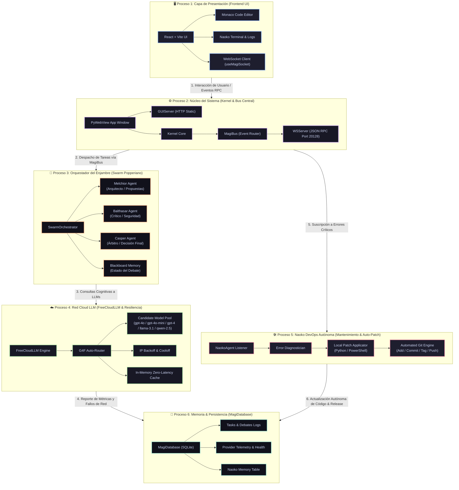

# MAGI System IDE 🖥️🤖

MAGI System IDE es un Entorno de Desarrollo Integrado (IDE) revolucionario, diseñado con una arquitectura de Enjambre de Inteligencias Artificiales colaborativas. Está construido para actuar como un compañero de programación altamente autónomo, analítico, seguro y resiliente.

---

## 🏗️ Arquitectura Completa del Sistema (Diagrama Unidireccional & Ramificaciones Horizontales)

El siguiente gráfico ilustra la arquitectura de **MAGI System IDE**, con un flujo unidireccional vertical de alto nivel que se ramifica horizontalmente en cada proceso y subproceso clave:

---

## Características Principales 🚀

- **Enjambre de IAs (Swarm):** MAGI no utiliza una sola IA. Integra un enjambre colaborativo (**Melchior**, **Balthasar**, **Casper**) que debaten y analizan el código desde múltiples perspectivas antes de emitir una propuesta final para el usuario.
- **Naoko (DevOps Autónoma):** Una IA de infraestructura independiente (`Naoko`) que supervisa la salud del sistema. Si detecta fallos, caídas de red o excepciones en caliente, **Naoko investiga el error, auto-repara el código fuente localmente y realiza los `git push` a GitHub automáticamente**.
- **Auto-Router Gratuito en la Nube:** MAGI utiliza motores LLM gratuitos en la nube (`G4F`) y los enruta automáticamente. Si una API aplica Rate Limit (429), MAGI aplica enfriamiento inteligente de IP y conmuta suavemente entre modelos candidata (`gpt-4o`, `gpt-4o-mini`, `gpt-4`, `llama-3.1-70b`, `qwen-2.5-coder`).
- **Resiliencia & GUI Integrado:** Aplicación de ventana nativa de alta respuesta basada en `pywebview` y frontend empaquetado en React/Vite.

---

## Instalación y Ejecución ⚡

1. Ve a la pestaña **[Releases](https://github.com/4n0th1ng/MAGI-System-IDE/releases)** en el repositorio de GitHub.
2. Descarga la última versión empaquetada (ej. `MAGI-IDE-v5.zip`).
3. Extrae el archivo ZIP ejecutable.
4. Ejecuta `MAGI-IDE-v5.exe` autónomo.
5. ¡Disfruta del enjambre colaborativo!

---

## Tecnologías 🛠️

- **Backend:** Python 3.10 (Asyncio, SQLite, PyInstaller, WebSockets, PyWebView)
- **Frontend:** React (Vite), TypeScript, TailwindCSS, Monaco Editor
- **IA:** g4f (Auto-routing para motores en la nube como GPT-4o, Claude 3.5, Qwen, Llama 3.1)

---
*MAGI System IDE - Enjambre Autónomo de Inteligencias Artificiales.*

> **Actualización Autónoma (v1.0.0):** Auto-reparación aplicada por Naoko: {'message': '[CRITICAL] magi.core.providers.cloud:
