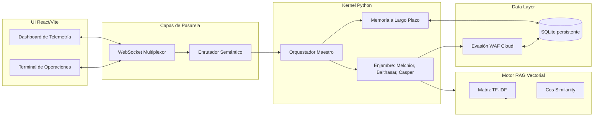

# MAGI System IDE (v2.0.0 SOTA)

MAGI System IDE es una plataforma cognitiva avanzada impulsada por un enjambre de Inteligencias Artificiales coordinadas, diseñado para asistir, automatizar y auditar flujos de trabajo de ingeniería de software a escala. Concebido originalmente como un núcleo cuántico abstracto, este sistema opera en modo *Standalone Portable* integrando un frontend reactivo ultrarrápido y un backend impulsado por RAG Vectorial.

---

## 🏛 Arquitectura Horizontal (Subdivisiones Funcionales)

MAGI no es un monolito. Es una colmena descentralizada de micro-agentes coordinados asíncronamente (Áreas 1 a 13) orquestados mediante un patrón de Bus de Mensajes.

### Subdivisiones Detalladas:
1. **Interfaz Holográfica Nativa (UI):** Empaquetada con `PyWebView` usando el motor de Edge de Windows para ejecutar React de forma nativa como un binario (`.exe`), sin servidores web pesados.
2. **Pasarela Bidireccional (RPC):** Un puente WebSockets con multiplexación asíncrona capaz de enrutar millones de tokens sin bloquear el hilo principal (hilo secundario de `asyncio`).
3. **El Enjambre (MagiHive):** Tres entidades autónomas (Melchior, Balthasar, Casper) que evalúan críticamente, votan y debaten antes de dar luz verde a una solución.
4. **Motor RAG Algebraico (AASLoader):** Evita la saturación del GPU. Usa la matriz de términos inversa (`Scikit-Learn` y `NumPy`) para indexar en memoria ram +2000 flujos de trabajo en <1ms.
5. **Evasor de WAF (Cloud Layer):** Subsistema `curl_cffi` para falsificar *hello packets* TLS de navegadores Chrome reales y burlar las protecciones de Cloudflare mediante enrutamiento en cuarentena.

---

## 🚀 Ciclo de Vida: Gráfico de Flujo Vertical

El siguiente diagrama de actividad técnica muestra el viaje microscópico de una señal (Query) desde su inyección por el usuario hasta la consolidación de la telemetría empírica.

```mermaid
sequenceDiagram
    participant User as Operador
    participant GUI as Interfaz Web (React)
    participant WSS as Servidor RPC
    participant Orch as Orquestador (Área 0)
    participant AAS as RAG (TF-IDF)
    participant Swarm as MAGI Swarm
    participant Net as Motor Cloud (Evasión)
    participant DB as SQLite Telemetría

    User->>GUI: Ingresa comando crítico
    GUI->>WSS: Payload JSON (WebSockets)
    WSS->>Orch: Deserialización y Enrutamiento
    
    rect rgb(20, 40, 20)
    Note over Orch, AAS: Fase 1: Enriquecimiento Semántico
    Orch->>AAS: Extraer contexto del comando
    AAS-->>Orch: Devuelve los mejores N Skills (Cosine Similarity)
    end
    
    rect rgb(40, 20, 20)
    Note over Orch, Net: Fase 2: Ejecución Cognitiva y Evasión
    Orch->>Swarm: Inyecta Contexto + Comando
    loop Debate
        Swarm->>Net: Solicita inferencia a LLM Externo
        Net-->>Net: Impersona TLS (Chrome 120)
        alt Rate Limit WAF detectado
            Net->>Net: Aplica Cuarentena TTL (300s)
            Net->>Net: Rota proveedor y reintenta
        end
        Net-->>Swarm: Respuesta LLM bruta
        Swarm->>Swarm: Falsacionismo Crítico (Casper/Melchior)
    end
    end

    rect rgb(20, 20, 40)
    Note over Orch, DB: Fase 3: Consolidación y Telemetría
    Swarm-->>Orch: Veredicto Unánime
    Orch->>DB: Registra Densidad de Código y Latencia
    Orch->>WSS: Despacha Payload Final
    WSS-->>GUI: Renderiza Output Markdown
    end
```

---

## 🛠️ Portabilidad Extrema

La versión 2.0.0 elimina todas las dependencias del usuario final. Gracias a un compilador basado en `PyInstaller` inyectado por GitHub Actions, todo el sistema (C, Rust, Python, React) se comprime en el archivo `MAGI-IDE.exe`.

- **0 Configuración:** La base de datos `magi_brain.db` (telemetría) se crea dinámicamente en el directorio de ejecución actual (CWD).
- **Ejecución Local:** Solo doble clic y MAGI despertará en una ventana nativa de alta velocidad.

## 🤝 Desarrollo y Despliegue

Para los mantenedores y agentes de software que modifican este núcleo:
1. Las Actions de GitHub `release.yml` detectan tags de versión (`v*`).
2. Toman el código, compilan el TypeScript a estáticos puros (`npm run build`).
3. Instalan las dependencias matemáticas de C++ precompiladas (`NumPy`, `Scikit`).
4. Lo entrelazan todo bajo `main.py` y publican `MAGI-IDE.exe` directo en la pestaña de *Releases* de GitHub.
