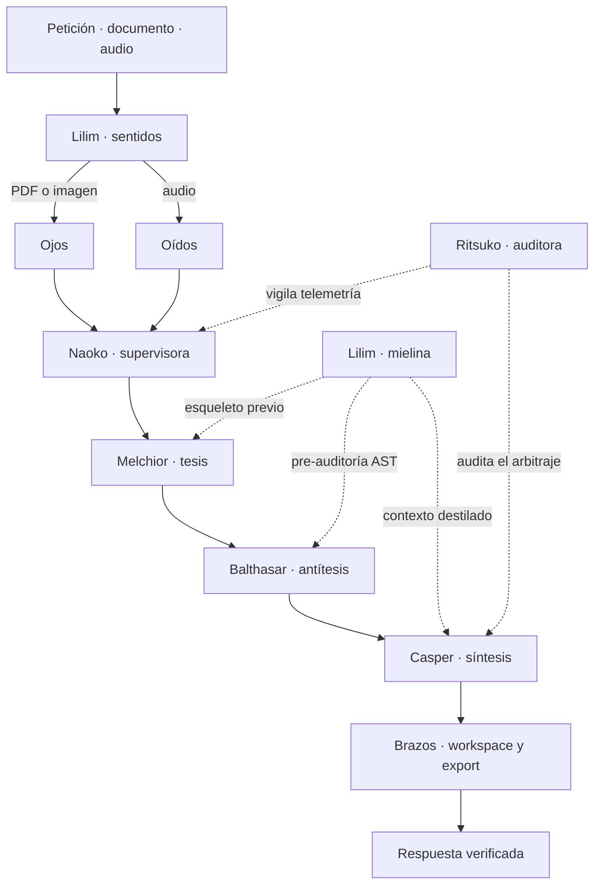

# Magisys

Un entorno de desarrollo con un **enjambre de tres inteligencias que aplican el
método dialéctico** (tesis → antítesis → síntesis), **herramientas reales sobre
tu máquina** para ejecutar lo que deciden, y una regla que lo atraviesa todo:
**una afirmación sin evidencia verificada no es una afirmación**.

Inferencia **100 % de nube gratuita**: sin claves de API, sin modelos locales,
sin suscripciones.

**[⬇ Descargar la última versión para Windows](https://github.com/zero-phoenix/Magisys/releases/latest)** — un `.zip`, se descomprime y se ejecuta. Sin instalador.

---

## Qué hay de nuevo en la v5.27.0: enjambre v6, percepción web, degradación D2 y plan vivo

- **Lilim Mielina & Sentidos Tridimensionales:** Inferencia local ultrarrápida (KoboldCpp con Qwen 2.5 1.5B Q4_K_M adaptado a i7-3770 / GTX 1050), acelerador dialéctico («vaina de mielina») para lubricar Melchior, Balthasar, Casper, Naoko y Ritsuko, y tríada sensorial completa: Ojos (inspección de PDFs escaneados e imágenes tipo Google Lens a 150-300 DPI con PyMuPDF), Oídos (validación acústica WAV/MP3/OGG y loopback WASAPI) y Brazos (actuación de workspace con informes Markdown/DOCX y hashing SHA-256).
- **D2 — Degradación de motor por salud:** cuando los proveedores gratuitos de `deep` fallan o superan el umbral de latencia/errores, el sistema degrada automáticamente a `fast` sin colgar la máquina.
- **L2 — `repos_clonar`:** clon shallow directamente al workspace con procedencia completa en el WriteJournal de la tarea (cumpliendo la compuerta A3).
- **F1 — Percepción web sin navegador:** herramientas `web_search` y `web_read` HTTP con presupuesto estricto por ronda y citas con URL + fecha obligatorias.
- **F2-F5 — Enjambre v6 consolidado:** subagentes por familia de modelo (`F2`), `plan.md` vivo con tarjeta en la interfaz (`F3`), compuerta automática obligatoria antes del cierre (`F4`) y 4to veredicto «la pregunta era otra» (`F5`) con memoria de descartes reutilizables.
- **C1-GUI — Informe de cancelación visible:** el reporte real de procesos parados y bucles cancelados se pinta directamente en el flujo de conversación.
- **L3-L4 — Lilim enciclopédico:** verificación automática de novedades tecnológicas 2023-2026 y enciclopedia por dominios.

## Cómo funciona

Escribes una petición. El sistema la procesa en una sola pasada:

1. **Naoko** clasifica tu petición y elige el **estilo** de respuesta que más
   conviene (técnico, sintético, creativo o analítico). Tú no eliges nada: ella
   decide.
2. **MELCHIOR** redacta la **TESIS**: construye la solución, escribe el código,
   la defiende.
3. **BALTHASAR** redacta la **ANTÍTESIS**: refuta a Melchior ejecutando su
   código, buscando el fallo real con evidencia.
4. **CASPER** (Gaspar) redacta la **SÍNTESIS definitiva**: integra tesis y
   antítesis con su propio juicio crítico y te entrega la respuesta consolidada,
   en español.

Una sola ronda por defecto. Si no estás de acuerdo, escribes tu feedback y una
segunda ronda arranca en Melchior con la síntesis previa de Casper + tus
observaciones.

```
                          ┌───────────────────────────┐
                          │   TU PETICIÓN / ARCHIVO   │
                          └─────────────┬─────────────┘
                                        │
           ┌────────────────────────────┴───────────────────────────┐
           │ LILIM (Sentidos): Ojos (Lens/PDF) · Oídos · Brazos      │
           └────────────────────────────┬───────────────────────────┘
                                        ▼
                               NAOKO elige el estilo
                                        │
                                        ▼
 MELCHIOR (gpt)  ───────TESIS───────▶  BALTHASAR (gemini)  ──────ANTÍTESIS──────▶  CASPER (command)
   (construye)                           (refuta con evidencia)                       (SÍNTESIS)
        ▲                                          ▲                                      │
        │      ════════════════════════════════════╧═══════════════════════════════════   │
        └──────║ LILIM (Vaina de Mielina): lubricación local 0-50ms / KoboldCpp Qwen ║◀───┘
               ════════════════════════════════════════════════════════════════════════
                                        │
                                        ▼
                         RESPUESTA DEFINITIVA (en español)

 RITSUKO (auditora) ──audita el bus y la salud sin tocar nada──▶ informes y megaplanes
```

**Ritsuko** es la quinta IA, y existe porque nadie comprobaba a la cuarta.
Naoko corrige al enjambre —detecta deriva, reordena el reparto, aplica
mejoras—, así que un diagnóstico suyo equivocado mueve el sistema entero en la
dirección equivocada con toda la autoridad. Ritsuko revisa eso: mira la
evidencia del bus, dice si el sistema mejora o empeora, señala cuándo un nodo
se ha quedado mudo y deja cada informe escrito en disco para descargar.

No arregla nada, a propósito: un auditor con permiso para aplicar cambios
acaba revisándose a sí mismo. Y usa una familia de modelo que **no comparte con
ninguna de las otras cuatro**, porque un auditor que se cae cuando se cae el
auditado no sirve justo el día que hace falta. Habla español o inglés, nunca
otro idioma.

---

## Los tres motores del enjambre

Cada nodo es una IA anclada a una **familia de modelo distinta**, para que el
crítico tenga sesgos diferentes al proponente. La interfaz muestra siempre la
familia que **de verdad** respondió.

| Nodo | Rol | Familia | Qué hace |
|---|---|---|---|
| **MELCHIOR** | TESIS | `gpt` | Construye: lee, escribe, ejecuta. Anticipa dónde fallará su propia propuesta. |
| **BALTHASAR** | ANTÍTESIS | `gemini` | Refuta: lee y **ejecuta** el código de Melchior, pero no escribe. Aporta evidencia, no sospechas. |
| **CASPER** | SÍNTESIS | `command` | Te habla. Integra ambas posiciones con juicio crítico y redacta la respuesta final. |

Las conclusiones (`### CONCLUSIÓN`) van **siempre en español**. Casper, que es
quien te lee, responde entero en español.

Cada IA es **consciente de su rol** y de que forma parte de un enjambre de tres.
Naoko también conoce los roles y puede explicarte qué hace cada nodo.

---

## Dos motores, nada más

La barra superior tiene un único selector con dos opciones:

- **🔍 Análisis profundo** (por defecto) — baja temperatura, más iteraciones de
  herramientas y verificación. Más lenta y más precisa.
- **⚡ Súper rapidez** — temperatura normal, menos vueltas. Rápida.

El estilo de redacción lo decide **Naoko automáticamente** según tu pregunta.

---

## Naoko: la supervisora que entiende el sistema

Naoko es externa al enjambre de tres. **Supervisa, diagnostica y repara**, y
además **decide el estilo** de cada respuesta:

- **Clasifica tu petición** (técnica, sintética, creativa, analítica) y propaga
  ese estilo a los tres agentes.
- **Repara sola** cuando hay un fallo con tests que lo demuestren. Sin
  consultar: el usuario no debe ser el cuello de botella de su propio sistema.
- **Mejora contigo** cuando el cambio es de criterio (no de corrección). Ahí va
  con compuertas: tú apruebas cada paso, y publicar es siempre tu decisión.
- **Conoce el enjambre**: si le preguntas «¿por qué Melchior hizo X?» o «¿qué
  tal está el enjambre?», referencia los roles correctamente.

---

## Ritsuko: quien revisa a la revisora

Naoko corrige a los tres nodos. Nadie corregía a Naoko — y eso no es teórico:
la auditoría del 20 de agosto la encontró declarando «deriva del modelo» en dos
familias enteras justo después de una tarea que había agotado la cuota de esos
mismos proveedores. Estaba midiendo su propia interferencia y llamándola avería.

Ritsuko es ese revisor. Corre en una familia de modelos **distinta** de las que
audita, tiene su propio chat y su propia pestaña, y habla solo español o inglés.

- **Solo informa.** No escribe código, no cancela tareas, no toca el reparto del
  enjambre.
- **Revisa los diagnósticos de Naoko** y puede anularlos. Cuando la evidencia
  se sostiene, lo confirma — «nadie lo miró» y «lo miré y está bien» son cosas
  distintas.
- **Escribe informes descargables** con la evidencia que los sostiene, en
  `%LOCALAPPDATA%\MagiSystem\informes-ritsuko`.

---

## Lilim: La vaina de mielina local y los sentidos periféricos

Lilim no es un cuarto árbitro dialéctico ni un auditor pasivo: es la **vaina de mielina** del sistema nervioso de MAGI y su enlace sensorial periférico. En biología, la mielina recubre los axones neuronales para permitir una conducción saltatoria ultraveloz de los impulsos. En MAGI, Lilim actúa como un lubricante cognitivo local (latencia de 0 ms en chequeos deterministas a ~45 tok/s en inferencia VLM) que acelera, desahoga y protege a Melchior, Balthasar, Casper, Naoko y Ritsuko.

### Arquitectura de Inferencia Neuronal Local: KoboldCpp + Qwen 2.5 1.5B

Para dotar a Lilim de capacidad de razonamiento e inspección visual en local sin comprometer la estabilidad del sistema ni saturar el hardware, la arquitectura se asienta sobre restricciones rigurosamente auditadas:

- **Motor KoboldCpp (`koboldcpp-oldpc.exe` / `cu11_oldcpu`):** El host opera con un procesador Intel Core i7-3770 (Ivy Bridge, SSE4.2 y AVX1, sin soporte para AVX2 ni FMA3). KoboldCpp es el único runtime contemporáneo que distribuye compilaciones especializadas sin instrucciones AVX2 ilegales, integrando descarga acelerada cuBLAS sobre GPUs NVIDIA Pascal.
- **VLM / LLM Local (Qwen 2.5 1.5B Instruct en GGUF Q4_K_M):** Con un peso aproximado de ~986 MB en VRAM, el modelo cabe íntegramente en la memoria de una NVIDIA GeForce GTX 1050 de 2 GB (~1.5 GB libres tras composición de escritorio DWM), manteniendo los tensores en GPU y evitando el trasvase punitivo de memoria a la RAM del sistema.
- **Cliente Asíncrono de Bajo Impacto:** Implementado en la biblioteca estándar de Python (`urllib.request` asíncrono / JSON), sin dependencias pesadas de frameworks externos. Si el endpoint de KoboldCpp (`http://127.0.0.1:5001`) no está activo o se encuentra ocupado, Lilim degrada de manera transparente (fail-safe) a los analizadores heurísticos deterministas de MAGI o a los proveedores en nube.

### La Conducción Saltatoria: Lubricación Dialéctica (Mielina)

El módulo `magi.modules.lilim.mielina` interviene antes y durante cada fase del debate dialéctico:

1. **Aceleración de Melchior (`lubricar_propuesta`):** Analiza sintáctica y léxicamente la intención del encargo. Extrae esqueletos de código y estructuras probadas, permitiendo que Melchior redacte la tesis sin consumir ciclos en boilerplate.
2. **Pre-auditoría Estática de Balthasar (`pre_auditoria_estatica` & `lubricar_critica`):** Ejecuta una verificación previa mediante el analizador sintáctico abstracto (AST de Python) en 0 ms. Si la propuesta de Melchior contiene errores sintácticos evidentes, Balthasar los refuta de inmediato con evidencia determinista antes de recurrir a modelos externos.
3. **Pre-síntesis de Casper (`lubricar_arbitraje`):** Evalúa solapamientos y contradicciones directas entre tesis y antítesis, entregando a Casper una matriz sintetizada para cerrar el veredicto en una única pasada fluida.
4. **Optimización de Diagnóstico para Naoko (`lubricar_vision`):** Pre-filtra inconsistencias visuales y métricas de pantalla para focalizar los auto-arreglos.
5. **Heurística Local para Ritsuko (`clasificar_intencion_local`):** Clasifica la taxonomía de la tarea en local para alimentar las auditorías de Ritsuko sin agotar la cuota de red.

### Tríada Sensorial Periférica: Ojos, Oídos y Brazos

Lilim extiende la interacción de MAGI más allá del texto plano mediante tres subsistemas especializados:

- **👁️ Ojos (`magi.modules.lilim.ojos` — Google Lens Local):**
  - **Rasterización de Documentos:** Transforma archivos PDF (vectoriales o escaneados) en mapas de bits de alta fidelidad mediante PyMuPDF (`fitz.Matrix`) a resoluciones configurables (150-300 DPI).
  - **Extracción de Layout y Bloques:** Extrae bloques de texto, coordenadas delimitadoras (`bbox`), metadatos de autoría y recuentos de página.
  - **Inspección Visual Multimodal:** Analiza imágenes escaneadas, diagramas y capturas de pantalla enviándolas al proyector visual de KoboldCpp / Qwen multimodal o puentes de visión, identificando texto ilegible, patrones de diseño y anomalías visuales.
- **👂 Oídos (`magi.modules.lilim.oidos`):**
  - **Inspección de Contenedores de Audio:** Analiza cabeceras de archivos WAV (PCM no comprimido), MP3 y OGG sin necesidad de decodificadores externos pesados.
  - **Verificación Acústica:** Extrae frecuencia de muestreo (Hz), canales, profundidad de bits y tasa de transferencia.
  - **Integración con Loopback:** Conecta con el analizador de audio WASAPI de MAGI (`percepcion/oidos.py`) para confirmar la presencia o ausencia de sonido real en juegos y emuladores.
- **🦾 Brazos (`magi.modules.lilim.brazos`):**
  - **Actuación y Reportes de Workspace:** Genera automáticamente informes técnicos estructurados en Markdown con trazabilidad, marcas de tiempo y procedencia.
  - **Generación Documental DOCX:** Exporta dictámenes, resoluciones y especificaciones a formato Microsoft Word nativo utilizando `docx`.
  - **Manipulación de Imágenes:** Recorta regiones de interés (ROI / bounding boxes) sobre capturas de pantalla de diagnóstico.
  - **Certificación de Integridad:** Computa resúmenes criptográficos SHA-256 inmutables de los artefactos generados para auditoría.

### Diagrama de Flujo y Mielinización



---

## Cómo trabaja el enjambre

Ocho reglas, sacadas de contrastar lo que hacía MAGI contra lo que hace un
agente que sí entrega. Cada una es un mecanismo con su prueba, no un consejo.

1. **El encargo es un contrato, no un tema.** «Un ping pong de 32 bits a todo
   color en un exe portable» son cuatro promesas separables. MAGI las enumera al
   empezar y comprueba al final cuáles quedaron sin cubrir.
2. **«Hecho» se define antes de empezar, y lo comprueba una máquina.** Nadie de
   este sistema ve la pantalla. Si el encargo es un juego, el artefacto tiene
   que nacer con `--autotest`; si pide un formato de color, con `--formato`. Se
   exigen al escribir, no al terminar.
3. **Mirar la caja antes de razonar de memoria.** Se le señalan por su nombre
   las herramientas que responden a ESE encargo, y para las que se pueden
   ejecutar solas el resultado ya viene puesto en el prompt.
4. **El porqué va pegado al arreglo.** Cada cambio de este repositorio lleva al
   lado la medición que lo forzó, para que quien venga a simplificarlo lea
   primero por qué existe.
5. **Desconfiar del propio informe de éxito.** Toda afirmación comprobable
   —«se compiló», «las pruebas pasan», «según analyze_port»— se contrasta contra
   el registro de lo que el sistema hizo de verdad.
6. **Si el último paso falla, el trabajo se conserva.**
7. **Pocas pasadas, bien dirigidas.** Tres propuestas que nadie ejecuta valen
   menos que una que sí.
8. **Se contestan todas las partes del enunciado.**

Y desde la v5.11.0, una más que ya no es opcional donde hay una pantalla de por
medio: **una corrida sin ojos no es evidencia**. Ver «Rondas verificadas» abajo.

---

## La columna izquierda: tus conversaciones

- **Títulos generados por IA**: cada conversación se nombra con un resumen corto
  de tu petición, no con un identificador críptico.
- **Archivar (📦)** y **borrar (🗑)** con confirmación inline.
- **Persistencia**: al cerrar y reabrir, tus conversaciones siguen ahí.

---

## Qué sabe hacer

Más allá de debatir, el enjambre tiene **67 herramientas** reales sobre tu
máquina, repartidas por rol y acotadas por dominio antes de entrar al prompt.

- **Ingeniería de software**: crear, modificar y ejecutar código, construir
  proyectos, empaquetar a `.exe` portable.
- **Ingeniería inversa y emuladores**: desensamblado (Capstone), emulación
  (Unicorn), entropía de Shannon por regiones.
- **Rondas de optimización verificadas**: bitácora acumulativa inyectada al
  prompt, protocolo de corrida con capturas (imagen + movimiento), dos
  contadores de FPS distinguibles y un harness (`vita3k_ctl.py`) que lanza el
  emulador sin manos. El caso piloto es YabauseVita (Sega Saturn para PS
  Vita): la ronda 1 encontró y arregló cinco bloqueos que el log daba por
  buenos.
- **Fábrica de artefactos que se mira a sí misma**: especificar → generar →
  ejecutar/renderizar → **observar** → criticar → iterar.
- **Vídeo programático**: animática Ken Burns, manga → vídeo en vertical, con
  detección de fotogramas en negro o congelados.
- **Mundo real**: macro, geopolítica y finanzas con fuentes gratuitas y sin
  clave (FRED, BCE, Banco Mundial, SEC EDGAR). Un dato no se construye sin
  fuente y fecha.

### Rondas verificadas: el caso YabauseVita

El repositorio del emulador lleva una bitácora (`docs/BITACORA-OPTIMIZACION.md`)
donde cada ronda deja lo medido y las reglas derivadas — nunca se borra nada.
MAGI la lee entera al empezar cada ronda y rechaza propuestas que choquen con
una regla pagada con evidencia. En la ronda 1, ese ciclo encontró: la CI rota
desde tres semanas, los flags agresivos, dos núcleos de emulación rotos que
reportaban 60 FPS fantasma, la cadena de vídeo incompatible y la BIOS de región
equivocada. Panzer Dragoon quedó a velocidad completa y Sonic R jugable —
verificado con capturas, no con log.

---

## Reversibilidad y parada

El acceso sin restricciones a tu máquina se sostiene sobre dos salidas:

- **Deshacer.** Antes de tocar un fichero se copia. `undo` lo devuelve, por
  operación o por tarea entera.
- **Parar.** `PARAR ESTA` cancela una conversación; `PARAR TODO` es la parada de
  emergencia. `SIGTERM` primero, `SIGKILL` solo si no atienden, con informe de
  lo que paró **de verdad**.

La misma copia que da la reversibilidad alimenta el **panel de aprobación**:
qué ficheros toca el cambio, su contenido antes y después con un diff real, las
órdenes que se ejecutarán y si los tests pasaron.

---

## La interfaz

- **Ctrl+K** abre la paleta de comandos con filtrado difuso.
- **Streaming token a token**: el primer token llega en ~2 s.
- **Traza de herramientas**: ver «leyendo `dynarec.cpp:412`» convierte una caja
  negra en un colaborador.
- **Panel de coste** con avisos — el principal detecta si los tres nodos
  corrieron sobre la misma familia.
- **Panel de sistema**: salud (latencias y tasas de fallo), banco de evaluación
  y auto-mejora medible.
- **Dónde se va el tiempo**: los agentes, familias y herramientas más lentos,
  ordenados por **p95**, no por media.
- **Salud por día** *(v5.5.0)*: chispa con la latencia diaria de cada candidato
  (14 días) y su tendencia.
- **Por qué faltan proveedores** *(v5.5.0)*: los que exigen tu cuenta separados
  de los caídos, cada uno con su motivo medido.

---

## Instalación

### Binario para Windows (recomendado)

**[⬇ Descargar la última versión](https://github.com/zero-phoenix/Magisys/releases/latest)**

1. En **Assets**, descarga **`Magisys.zip`**.
2. Verifica la descarga (opcional): `certutil -hashfile Magisys.zip SHA256`
   contra **`CHECKSUMS.txt`**, que se publica junto al zip.
3. Descomprímelo donde quieras — no hay instalador ni carpetas obligatorias.
4. Ejecuta **`Magisys.exe`**.

Windows SmartScreen avisará porque el binario no está firmado: *Más
información → Ejecutar de todas formas*.

Va en `.zip` a propósito: Windows y muchos navegadores bloquean o marcan un
`.exe` descargado suelto. Lo compila **GitHub Actions** desde el tag, tras pasar
la suite completa de tests; no hay ninguna subida manual de por medio.

El binario **lleva su propio Python 3.10 dentro**, así que las herramientas que
ejecutan código funcionan sin que tengas Python instalado.

### Desde el código

```bash
git clone https://github.com/zero-phoenix/Magisys
cd Magisys
pip install -r requirements.txt

cd magi-gui && npm ci && npm run build && cd ..
python -m magi.main
```

Opcionales, detectados si están: `capstone` y `unicorn` (ingeniería inversa),
`pygame` y `pillow` (observar juegos e imágenes — las capturas verificadas de
las rondas usan Pillow), `ffmpeg` (vídeo), ComfyUI en `127.0.0.1:8188` (dibujo).
Sin ellos el sistema funciona y **avisa de lo que no puede hacer**, en vez de
fingir.

### Ejecutar una ronda del emulador desde el código

```bash
python scripts/ronda_emulador.py --repo C:\ruta\al\yabausevita-zp
```

Cada experimento (NiGHTS largo, input, dynarec, perfil SH2) sale como JSON con
veredicto en formato R9: imagen + movimiento + ambos FPS + errores.

---

## Cómo está construido esto

Siete reglas, cada una nacida de un fallo real:

1. **Todo cambio se conecta o se borra.** Nunca se añade sin conectar.
2. **Un test sobre una pieza aislada no prueba que el sistema la use.** Por eso
   hay una auditoría del grafo de llamadas con AST y un trinquete de tamaños
   que solo puede bajar.
3. **Cada capacidad del backend tiene que poder invocarse desde la interfaz.**
4. **Arrancar encuentra fallos que leer no encuentra.**
5. **«No he podido comprobarlo» no es «está bien».** Sin Pillow, el observador
   de imágenes devolvía «correcto» sobre una captura que nunca llegó a abrir.
6. **El binario publicado no es el mismo programa que el de desarrollo.**
7. **Arreglar algo no es lo mismo que arreglarlo donde importa.** Un cambio no
   está hecho hasta que se comprueba **en el camino por el que pasa el sistema
   de verdad**.


## Autonomía: trabajar sin supervisor detrás

El objetivo del sistema es operar **solo con los prompts de una persona
común**, sin otra IA supervisándolo. Cada versión acerca eso:

- **El motor se adapta al encargo.** Los encargos triviales («crea un script
  que imprima X») arrancan al instante en modo rápido, sin la llamada de
  estilo ni las cuatro iteraciones del modo profundo — medido: de 20+ min a
  segundos de arranque. Los encargos serios siguen con Naoko eligiendo estilo
  y el motor que pidió quien escribe. Ante la duda, nada es trivial: solo se
  baja la marcha, nunca se sube a quien pidió prisa.
- **Ritsuko vigila el reloj que la persona percibe.** El eco del chat (>2 s)
  y el arranque de ronda (>30 s) quedan registrados como hallazgos con
  número — el caso real que la motivó fue un eco a los 10,6 s que el usuario
  descubrió con una captura.
- **Segunda firma en las entregas.** Al cerrar cada tarea, Ritsuko firma lo
  que constaba: `VERIFICADA` (hay artefacto), `DECLARADA_INCOMPLETA` (el
  sistema avisó) o `SIN_ARTEFACTO` (la evidencia no está — un hecho, no una
  acusación).
- **Las reglas del proyecto viajan con el proyecto.** La bitácora del
  emulador, sus reglas §5.2 y los descartes rescatables se inyectan sobre el
  prompt: el enjambre no repite lo ya medido ni propone lo ya prohibido, y
  las tres filosofías ortogonales (hacer menos / mover menos / repartir
  mejor) se asignan por variante, no por suerte de semilla.
- **La versión que ves es la que corres.** El pie de la interfaz lee la
  versión del kernel en vivo; el sistema se audita usándose a sí mismo y lo
  que encuentra se corrige con la medición pegada al commit.

**1788 tests en Python · 131 en la interfaz · sin tests verdes no hay release.**

Y esa regla no depende del CI. Lo mismo que ejecuta GitHub Actions se ejecuta
aquí, con los mismos comandos:

```bash
python scripts/verificar.py            # lo de cada push  (~4 min)
python scripts/verificar.py --todo     # + los que compilan un .exe (~10 min)
```

Existe porque el CI se paró en seco el 13-ago: repositorio privado, minutos de
Actions agotados. Una regla que depende de un servicio de pago no es una regla,
es una suscripción. (El repositorio es público desde el 30-ago: los minutos ya
no se agotan, pero la regla se queda.)
