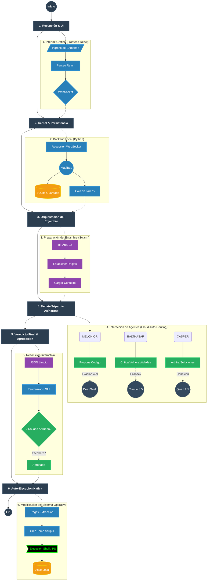

# MAGI System IDE (V5.0.11)

MAGI System IDE es una interfaz gráfica de escritorio y un orquestador backend potenciado por un enjambre de Inteligencias Artificiales coordinadas, diseñado para operar localmente y comunicarse con proveedores de IA en la nube mediante técnicas de evasión, proporcionando un entorno autónomo de ingeniería de software.

## 🚀 Características Principales

*   **Enjambre de IA Tripartito (Balthasar, Melchior, Casper):** Tres nodos especializados debaten asíncronamente para proponer código, criticar vulnerabilidades y arbitrar decisiones finales.
*   **Red Nube Evasiva (G4F Auto-Routing Resiliente):** Se eluden los bloqueos de Rate Limit (Error 429) mediante intercepción dinámica de modelos caídos. Si un modelo complejo colapsa (ej. Claude/Qwen), MAGI lo enruta nativamente de manera transparente hacia el modelo más estable (`gpt-4o`) para garantizar la persistencia del Enjambre sin API Keys.
*   **Layout Maestro de 3 Columnas:** Una interfaz construida en React de alto rendimiento. Integra gestor de proyectos, visualizador del enjambre y paneles técnicos (Código, Terminal, Pestaña de Configuración Nativa y Telemetría) en una sola vista persistente con texto completamente seleccionable.
*   **Ejecución Git Nativa:** Funcionalidad de autoconexión para clonar y operar sobre repositorios remotos directamente en el disco duro físico (`scratch/`) con *feedback* directo a la consola del IDE.
*   **Telemetría Empírica:** Métrica de desempeño algorítmico, velocidad de inferencia, fallos y densidad de código monitorizada permanentemente en una base de datos SQLite persistente.
*   **Portabilidad Extrema:** Empaquetado completo en un solo ejecutable (`.exe`) sin dependencias mediante PyInstaller y PyWebView (Motor Edge de Windows).

---
## 🗺️ Arquitectura del Sistema: Flujo Integral Unidireccional

El siguiente diagrama detalla minuciosamente el ciclo de vida, integrando cada detalle de los procesos interactivos y lógicos de la arquitectura del Enjambre MAGI:

## 📦 Compilación

Para compilar el proyecto en un ejecutable `.exe` portable en Windows:

1. Instalar dependencias en el entorno base:
   `pip install -r requirements.txt`
2. Construir la UI (requiere Node.js):
   `cd magi-gui && npm run build`
3. Ejecutar PyInstaller:
   `powershell -ExecutionPolicy Bypass -File build.ps1`

El resultado estará en `dist/MAGI-IDE-v5.exe`.
