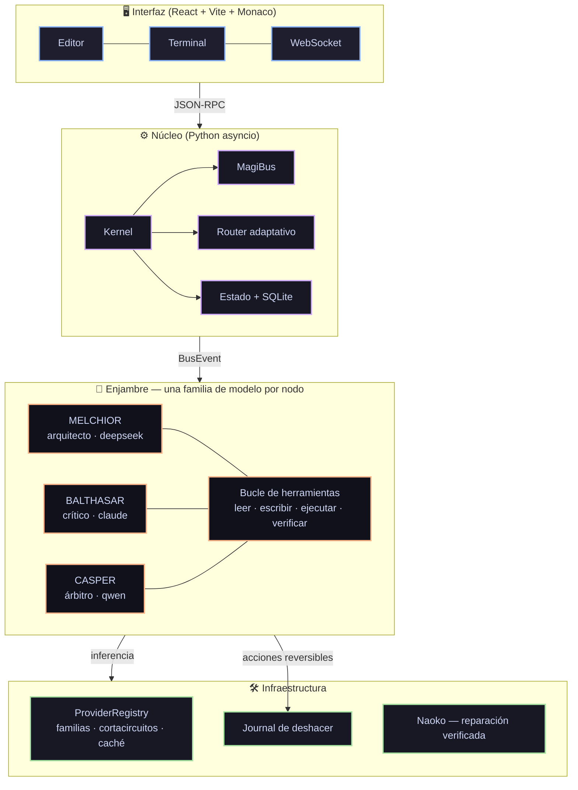

# MAGI System IDE 🖥️🤖

Entorno de desarrollo con un **enjambre de tres inteligencias que debaten** antes
de actuar, y **herramientas reales sobre tu máquina** para ejecutar lo que deciden.

Inferencia **100 % de nube gratuita**: sin claves de API, sin modelos locales,
sin suscripciones.

---

## Cómo funciona



### El enjambre

| Nodo | Rol popperiano | Familia | Puede |
|---|---|---|---|
| **MELCHIOR • 1** | Creador / sintetizador | `deepseek` | leer, escribir, ejecutar |
| **BALTHASAR • 2** | Crítico hostil / falsacionista | `claude` | leer y **ejecutar**, no escribir |
| **CASPER • 3** | Juez / árbitro de concordia | `qwen` | leer y verificar tests |

Que Balthasar no pueda escribir no es una restricción de seguridad: es lo que le
da autoridad. Una crítica que dice *«esto falla con entrada vacía»* **habiendo
ejecutado el caso** vale mucho más que una que lo sospecha.

### Enrutamiento adaptativo

No todo merece un debate de tres rondas.

| Ruta | Cuándo | Coste |
|---|---|---|
| `chat` | saludo, confirmación | 1 llamada |
| `lookup` | pregunta factual | 1 llamada + web |
| `task` | acción concreta sobre ficheros o código | Melchior + verificación |
| `build` | proyecto, juego, emulador, investigación | debate completo iterado |

---

## Instalación

Descarga la última versión de **[Releases](https://github.com/4n0th1ng/MAGI-System-IDE/releases)**,
extrae y ejecuta el `.exe`. No hay que configurar claves ni descargar modelos.

Desde el código:

```bash
pip install -r requirements.txt
cd magi-gui && npm install && npm run build && cd ..
python -m magi.main
```

---

## Tecnologías

**Núcleo:** Python 3.10+ · asyncio · pydantic · SQLite · WebSockets · PyWebView
**Interfaz:** React 19 · TypeScript · Vite · Monaco Editor · xterm.js · Zustand
**Inferencia:** g4f — nube gratuita sin claves, con proveedor fijado por familia

---

## Estado del proyecto — MAGI 9.0

Esta versión es una **reconstrucción del núcleo**. El diagnóstico que la motivó,
con la evidencia de cada punto, está en [`PLAN-MAGI-9.md`](PLAN-MAGI-9.md).

Lo que se arregló, y qué había antes:

| Área | v5.0.28 | Ahora |
|---|---|---|
| **Diversidad del enjambre** | `cloud.py:122` reescribía los alias a `gpt-4o` **y** `agents.py` pedía `model="gpt-4o-mini"` en los tres nodos: dos capas colapsando al mismo modelo | Cada nodo declara su familia y la pide explícitamente. Verificado de extremo a extremo, no solo en el registro |
| **Herramientas** | Los agentes solo emitían texto; la única acción era un regex que ejecutaba bloques ` ``` ` a ciegas | Bucle de herramientas en los tres nodos: leer, escribir, ejecutar, verificar. Traza visible en la interfaz |
| **Enrutamiento** | Toda petición pagaba el debate completo: "hola" costaba 9 llamadas y 90 s | 4 rutas con presupuesto de rondas y herramientas propio |
| **Reversibilidad** | Ninguna | Journal de escrituras + `undo` por operación o por tarea |
| **Timeouts** | Ninguno: un proveedor colgado congelaba el sistema | Timeout duro por llamada, con failover |
| **Cortacircuitos** | `_is_alive` y `_mark_failure` definidos, **cero sitios de llamada** | Implementado y llamado, con p50/p95 por proveedor |
| **Caché** | `dict` sin límite → fuga de memoria | LRU + TTL acotada |
| **Rutas** | `D:/PROYECTOS/MAGI System IDE` en 8 sitios: el `.exe` solo arrancaba en una máquina | `magi.core.paths`, verificado en CI |
| **Base de datos** | `magi_brain.db` commiteado con datos reales, y tres rutas distintas según cómo se instanciara | Una sola ruta vía `paths.db_path()`, fuera del repositorio |
| **Estado entre reinicios** | `active_tasks = {}` en RAM: cerrar la ventana perdía la conversación | Persistido en SQLite y rehidratado al arrancar |
| **Streaming** | `create()` sin `stream=True`: 30-90 s de pantalla quieta por turno | Token a token con cursor en vivo; caída a no-streaming si el proveedor no lo soporta |
| **Contabilidad de tokens** | Ninguna | `token_ledger` por tarea, agente y familia |
| **Estilo narrativo** | `<select>` que no enviaba su valor a ninguna parte | Llega al prompt de los tres agentes y persiste |
| **Selector de motor** | `kernel.py:216` no pasaba `engine` a `submit_task` | Propagado |
| **Aprobación por diff** | Los `sendCommand` estaban comentados: pulsar «Aprobar» no llegaba al backend | Reconectado |
| **Versionado de Naoko** | Default `v1.0.0` produjo el commit `1eb7e87`, una **regresión** entre v5.0.24 y v5.0.25 | Versión leída de git; si no se puede determinar, **no se etiqueta** |
| **Publicación de Naoko** | `git add .` + commit + tag + push, sin revisar ni verificar | Solo los ficheros del parche, y sin push automático |
| **Contexto** | Los agentes no sabían la fecha ni en qué SO corrían | Bloque de contexto real en cada prompt |
| **Tests** | En `scratch/` (gitignorado); `test_area0` en rojo | **150 tests** versionados —incluidos los de integración que recorren el camino real—, CI en Linux y Windows |
| **Propuestas** | Una sola, secuencial | 2-3 enfoques en paralelo; el crítico los compara |
| **Crítica** | Un párrafo genérico | 4 ejes concurrentes: corrección, seguridad, plataforma, rendimiento |
| **Código propuesto** | Llegaba al árbitro sin ejecutarse: tres rondas debatiendo sobre código que no compila | Verificado antes de la crítica; si falla vuelve al autor sin gastar ronda |
| **Memoria del debate** | Cuatro subsistemas de memoria instanciados y nunca llamados | Memoria episódica que inyecta lo ya refutado en la ronda siguiente |
| **Módulos aleatorios** | `quantum_oracle` devolvía `random.choice`; `quant/simulator` devolvía `np.random` como índice de riesgo | Retirados a [`magi/_attic/`](magi/_attic/) con nota de por qué |

### Reglas de trabajo

> **1. Cada cambio conecta o borra. Nunca añade sin conectar.**

> **2. Un test sobre una pieza aislada no demuestra que el sistema la use.**

> **3. Toda pieza necesita una prueba de CABLEADO, no solo de comportamiento.**

La segunda regla salió de un error real cometido durante esta misma
reconstrucción: la diversidad se arregló en `ProviderRegistry`, los tests
unitarios de `select_for_swarm()` pasaban en verde... y el enjambre seguía
colapsando a una sola familia, porque nunca llamaba a esa función. Iba por
`agents.py`, que pedía `model="gpt-4o-mini"` en los tres nodos.

Volvió a pasar dos veces más: `VerifiedRepair` escrito y sin conectar mientras
Naoko seguía ejecutando scripts a ciegas, y el bucle de herramientas conectado
solo a Naoko mientras los tres nodos del enjambre seguían sin poder abrir un
fichero. En los tres casos los tests unitarios estaban en verde.

Por eso hay dos capas de defensa: `tests/test_swarm_integration.py` recorre
orquestador → agentes → proveedor y comprueba el resultado observable, y
`tests/test_wiring.py` audita el **grafo de llamadas con AST** — no mira si una
función funciona, mira si el sistema la invoca.

Si un módulo no tiene sitio de llamada y un test, no entra. En v5.0.28 doce
subsistemas se instanciaban en `main.py` y diez tenían **cero** llamadas: existían
para imprimir su propio nombre en el arranque.

---

## Desarrollo

```bash
python -m pytest tests/ -v        # 150 tests, sin red
ruff check magi/ tests/           # lint
```

---

## Hoja de ruta

**Fase 1 completa** — capa de proveedores (§1.1), streaming extremo a extremo
(§1.2), anclaje de rutas (§1.3), estado persistente (§1.4), tests y CI (§1.5),
higiene del repositorio (§1.6).

**Fase 2 completa** — bucle de herramientas (§2.2), enrutamiento adaptativo
(§2.3), paralelismo de propuestas y crítica multi-eje (§2.4), verificación
ejecutable antes del arbitraje (§2.5), memoria episódica (§2.6), estilo
narrativo conectado (§2.7).

**Fase 3 en curso** — el ciclo `VerifiedRepair` de Naoko ya está conectado
(§3.1-§3.3). Pendiente: observabilidad proactiva (§3.4) y banco de evaluación
para auto-mejora medible (§3.5).

**Siguiente** — toolchain de ingeniería inversa para emuladores (§5.3) y fábrica
de artefactos (§5).

---

*MAGI System IDE — enjambre de inteligencias con manos.*
