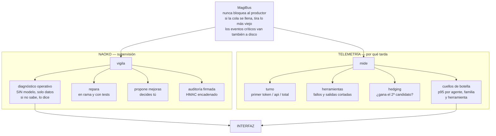

# MAGI System IDE

Entorno de desarrollo con un **enjambre de tres inteligencias que debaten antes
de actuar** y **herramientas reales sobre tu máquina** para ejecutar lo que
deciden.

Inferencia **100 % de nube gratuita**: sin claves de API, sin modelos locales,
sin suscripciones.

**Más de 860 tests en Python · 80 en la interfaz · sin tests verdes no hay release.**

**[⬇ Descargar el ejecutable de Windows](https://github.com/4n0th1ng/MAGI-System-IDE/releases/latest)** — un `.zip`, se descomprime y se ejecuta.

---

## Índice

- [Cómo funciona, de arriba abajo](#cómo-funciona-de-arriba-abajo)
- [La idea](#la-idea)
- [El enjambre](#el-enjambre)
- [Naoko: repara sola, mejora contigo](#naoko-repara-sola-mejora-contigo)
- [Qué sabe hacer](#qué-sabe-hacer)
- [Cómo decide qué esfuerzo merece cada petición](#cómo-decide-qué-esfuerzo-merece-cada-petición)
- [Reversibilidad y parada](#reversibilidad-y-parada)
- [La interfaz](#la-interfaz)
- [Instalación](#instalación)
- [Cómo está construido esto](#cómo-está-construido-esto)

---

## Cómo funciona, de arriba abajo

El flujo baja en una sola dirección: **lo que escribes** entra por arriba y
**lo que se ejecuta** sale por abajo. Cada etapa se abre en horizontal para
enseñar sus caminos, incluidos los que **no** siguen adelante — que suelen ser
los que explican por qué algo no pasó.

```mermaid
flowchart TD

TU["TU MENSAJE<br/>escribes en la interfaz"] --> ADM

subgraph G1["1 · ADMISIÓN — aquí nada desaparece en silencio"]
  direction LR
  ADM["se escribe ANTES<br/>de decidir nada"]
  ADM --- AD1["ahora<br/>se atiende ya"]
  ADM --- AD2["encolar<br/>el enjambre está ocupado:<br/>espera turno, no se tira"]
  ADM --- AD3["descartada<br/>con MOTIVO obligatorio:<br/>lo impide la base de datos"]
  ADM --- AD4["fallida<br/>reventó, y consta"]
end

ADM ==> EST

subgraph G2["2 · ESTADO — ¿la tarea tiene bucle VIVO?"]
  direction LR
  EST["supervisor.is_running"]
  EST --- ES1["nueva<br/>se crea"]
  EST --- ES2["interrumpida<br/>se reanuda con tu orden"]
  EST --- ES3["esperando tu visto bueno<br/>tu sí la cierra"]
  EST --- ES4["viva de verdad<br/>tu mensaje se encola"]
end

EST ==> RUT

subgraph G3["3 · RUTA — cuánto esfuerzo merece esto"]
  direction LR
  RUT["clasificador"]
  RUT --- RU1["chat<br/>1 ronda"]
  RUT --- RU2["task<br/>2 enfoques"]
  RUT --- RU3["build<br/>3 enfoques"]
end

RUT ==> MEL

subgraph G4["4 · MELCHIOR propone — N enfoques EN PARALELO"]
  direction LR
  MEL["una copia y una semilla<br/>por rama"]
  MEL --- ME1["enfoque A"]
  MEL --- ME2["enfoque B"]
  MEL --- ME3["enfoque C"]
end

MEL ==> IDI

subgraph G4B["4b · GUARDA DE IDIOMA — antes de que lo veas"]
  direction LR
  IDI["¿responde en TU idioma?"]
  IDI --- ID1["sí<br/>sigue"]
  IDI --- ID2["no<br/>se rota de familia<br/>y se reintenta, callando"]
end

IDI ==> VER

subgraph G5["5 · VERIFICACIÓN — el código se EJECUTA antes de debatirlo"]
  direction LR
  VER["ProposalVerifier"]
  VER --- VE1["arranca<br/>sigue al crítico"]
  VER --- VE2["no arranca<br/>VUELVE A LA ETAPA 4<br/>sin gastar ronda"]
  VER --- VE3["GUI / juego<br/>arranca headless<br/>se ejecuta y se valida"]
end

VER ==> BAL

subgraph G6["6 · BALTHASAR critica — 4 ejes EN PARALELO"]
  direction LR
  BAL["puede leer y ejecutar,<br/>NO escribir"]
  BAL --- BA1["corrección"]
  BAL --- BA2["seguridad"]
  BAL --- BA3["rendimiento"]
  BAL --- BA4["mantenibilidad"]
end

BAL ==> CAS

subgraph G7["7 · CASPER decide"]
  direction LR
  CAS["arbitra"]
  CAS --- CA1["aprobada<br/>te pide el visto bueno"]
  CAS --- CA2["rechazada<br/>VUELVE A LA ETAPA 4<br/>ronda siguiente"]
  CAS --- CA3["agotó rondas<br/>te lo entrega igual"]
end

CAS ==> APR

subgraph G8["8 · TU APROBACIÓN — con el diff y los tests delante"]
  direction LR
  APR["swarm.approval_required"]
  APR --- AP1["escribes sí<br/>se ejecuta"]
  APR --- AP2["pides un cambio<br/>VUELVE A LA ETAPA 4"]
  APR --- AP3["preguntas otra cosa<br/>abre tarea nueva"]
end

APR ==> EJE

subgraph G9["9 · EJECUCIÓN sobre tu máquina"]
  direction LR
  EJE["journal + supervisor"]
  EJE --- EJ1["escribe ficheros<br/>reversible"]
  EJE --- EJ2["ejecuta procesos<br/>se pueden parar"]
  EJE --- EJ3["artefactos<br/>Vista previa"]
end

EJE ==> FIN["RESULTADO<br/>se archiva, no se acumula"]
```



### Lo que corre en paralelo todo el rato

Estos dos no están en la cadena de arriba porque no la bloquean: observan.



---

## La idea

Tres modelos discutiendo entre sí no valen nada si los tres son el mismo
modelo. La versión anterior de este sistema tenía un «debate popperiano» en el
que los tres nodos llamaban a `gpt-4o-mini`: un modelo hablando solo, con tres
nombres distintos.

Ahora cada nodo está anclado a una **familia de modelo diferente** y la interfaz
muestra la familia que **de verdad** respondió, no la que tenía asignada. Si un
proveedor se cae y el registro conmuta a otro, se dice.

Y un agente que solo emite texto no es un colaborador. Los tres nodos pueden
**leer, escribir, ejecutar y verificar** sobre tu máquina.

---

## El enjambre

| Nodo | Rol popperiano | Familia | Puede |
|---|---|---|---|
| **MELCHIOR** | Creador / sintetizador | `gpt` | leer, escribir, ejecutar |
| **BALTHASAR** | Crítico hostil / falsacionista | `gemini` | leer y **ejecutar**, no escribir |
| **CASPER** | Juez / árbitro | `command` | leer y verificar tests |

Las familias no salen de esta tabla: salen de
`magi/data/catalogo_proveedores.json`, y la interfaz muestra la que **de verdad**
respondió. Esta tabla llegó a decir `deepseek`, `claude` y `qwen` mucho después
de que esas tres se quedaran sin un solo candidato vivo — documentación que
contradice al código es peor que no tenerla.

Que Balthasar no pueda escribir no es una restricción de seguridad: es lo que le
da autoridad. Una crítica que dice *«esto falla con entrada vacía»* **habiendo
ejecutado el caso** vale mucho más que una que lo sospecha.

Las **49 herramientas** se reparten por rol y se acotan por dominio antes de
entrar en el prompt. No es una optimización cosmética: el catálogo completo son
4,7 KB en cada turno, y un proveedor gratuito con eso delante deja de responder.
Acotado por lo que se está haciendo, Melchior reparando código ve 12
herramientas y 890 bytes.

### Los tres hablan tu idioma, y se comprueba

Decirle a un modelo «responde en español» no basta cuando el modelo es un
proveedor gratuito. Casper llegó a entregar su aprobación en chino
(`三个方案...`) con la instrucción puesta en el prompt, porque **nadie miraba la
respuesta**.

Ahora se mira. Si la respuesta llega en otro alfabeto, se rota de familia y se
reintenta —con tope de dos intentos, porque un detector heurístico se equivoca y
sin tope un solo falso negativo dispara treinta llamadas de red por turno—. El
proceso es interno: tú recibes la respuesta en tu idioma, no un comentario sobre
por qué hubo que pedirla otra vez.

La comprobación está en los **dos** caminos, el de streaming y el normal. Estuvo
solo en el segundo durante una versión, y como el enjambre usa el primero, el
arreglo no arregló nada: los tres nodos seguían contestando en chino con la
guarda ya «puesta».

Y la comprobación no se libraba por respuesta corta. Una versión anterior tenía
`return len(respuesta.split()) < 12`: cualquier respuesta de menos de doce
palabras se daba por buena **en el idioma que fuera**. Una frase como *«Sure! I
will create a Tetris game for you.»* pasaba por español válida, la guarda nunca
rotaba, y el usuario veía las tres IA contestándole en inglés. Ahora se exige un
mínimo de señal del idioma esperado —dos palabras vacías—, por corta que sea la
respuesta.

---

## Naoko: repara sola, mejora contigo

Naoko supervisa el sistema, y tiene **dos vías separadas a propósito**, porque
reparar y mejorar no son lo mismo:

- **Reparar** devuelve el sistema a donde ya debía estar. Hay un fallo, hay
  tests que lo demuestran, y la corrección es verificable. Va **sin consultar**:
  consultar cada arreglo convierte al usuario en el cuello de botella de su
  propio sistema.
- **Mejorar** cambia *hacia dónde va* el sistema. No hay un «correcto» contra el
  que comprobar: hay un criterio, y el criterio es tuyo. Va **con compuertas**.

**Publicar es siempre tuyo**, aunque el cambio sea una reparación: subir a
GitHub es visible para terceros y no se deshace con un `undo`.

### El ciclo de mejora

Cuando Naoko detecta un método más eficiente o más rápido —citando fichero y
línea, nunca una vaguedad— o cuando la propuesta es tuya, el plan da **dos
vueltas completas** al enjambre antes de volver a ti:

```
        tú apruebas la idea
                │
                ▼
        NAOKO redacta el plan
                │
                ▼
        tú apruebas el borrador
                │
                ▼
   ┌────────────────────────────────┐
   │  MELCHIOR   analiza y mejora   │
   │       ▼                        │   ×2 circuitos
   │  BALTHASAR  crítica popperiana │
   │       ▼      del plan Y de lo  │
   │             que dijo Melchior  │
   │  CASPER     evalúa las tres    │
   │             cosas por separado │
   │             y añade temas      │
   └────────────────────────────────┘
                │
                ▼
     plan hiperperfeccionado → tú decides
                │
                ▼
   NAOKO ejecuta, narrando cada paso
                │
                ▼
        tú autorizas publicar
```

Las compuertas viven en la **máquina de estados**, no en el prompt. La
diferencia importa: un modelo puede ignorar «consulta antes de continuar», pero
no puede inventarse una transición que no existe. Y lo mismo vale para la
verificación — la suite se ejecuta en código, no se le pide amablemente al
modelo que la ejecute.

Mientras trabaja, Naoko es **expresa**: cada herramienta que llama, cada fichero
que toca y cada resultado de la suite salen a la vista en el panel de mejoras y
en el terminal. Lo que **no** hace es narrar sus reintentos internos: cuando un
proveedor le contesta en otro idioma, rota y sigue. Un aviso por cada rotación
llenaba la pantalla de mensajes que no describían tu problema.

---

## Qué sabe hacer

### Ingeniería inversa y emuladores

Desensamblado con **Capstone** (MIPS, ARM, x86), emulación con **Unicorn**,
prueba diferencial entre dos implementaciones, matriz de portabilidad entre
consolas e indexado del código real de un emulador para poder citarlo.

Y **entropía de Shannon** por regiones, que es lo que distingue un binario
cifrado de código roto: la media global de un EBOOT no dice nada porque mezcla
cabecera y carga útil, y una sección cifrada dentro de un fichero por lo demás
normal solo se ve mirando por tramos.

### Fábrica de artefactos que se mira a sí misma

    ESPECIFICAR → GENERAR → EJECUTAR/RENDERIZAR → OBSERVAR → CRITICAR → ITERAR

La clave es OBSERVAR. Un sistema que genera un juego y te lo entrega sin
haberlo arrancado ha *generado código de juego*; uno que lo arranca, captura un
fotograma y lo mira, ha *hecho un juego*.

Hay rama de observación para las seis clases: programas, juegos, imágenes,
documentos, **vídeo** y **datos**. Las dos últimas faltaban, y su ausencia no
daba error: un `.mp4` y un `.csv` se despachaban a «ejecutar como Python» y el
agente recibía `SyntaxError: source code cannot contain null bytes` al pedir que
se mirase el vídeo que acababa de hacer.

### Vídeo programático

Animática Ken Burns, manga → vídeo en vertical, y grabación de un programa
gráfico en ejecución. Un vídeo tiene dos formas de salir mal que ninguna
comprobación barata ve, porque el fichero existe, pesa megas y se reproduce:
**todo negro** y **congelado** —todos los fotogramas idénticos, la animación que
no animó—. `observe_video` muestrea fotogramas separados en el tiempo y los
compara.

Solo están construidos los escalones que dan resultado profesional hoy y sin
coste. El gen-vídeo largo y coherente no está resuelto localmente en hardware de
escritorio, y fingirlo sería vender humo.

### Manga

La composición —rejilla, orden de lectura **derecha a izquierda**, globos,
validación de solapes— es geometría determinista y está construida y probada. La
generación de los dibujos necesita ComfyUI local (gratis, sin claves) y va
detrás de un backend enchufable: sin ComfyUI las viñetas salen como marcadores
de posición y el sistema **lo dice**, en vez de fingir que dibujó.

`validate_manga_layout` comprueba solapes, huecos y viñetas fuera de página
**antes** de generar nada: descubrir después que dos viñetas se pisan es tirar
ocho generaciones.

### Mundo real: macro, geopolítica y finanzas

Todas las fuentes son **gratuitas y sin clave de API**, probadas contra la red
antes de escribir los parsers: FRED, BCE, Banco Mundial, SEC EDGAR y RSS
oficiales.

Un dato **no se puede construir sin fuente y fecha** — no es un campo opcional.
Y se distinguen dos fechas que casi todo el mundo confunde: a qué momento se
refiere el dato, y cuándo lo descargamos nosotros. Confundirlas es cómo un
sistema acaba diciendo «el paro es del 4,2 %» citando una cifra de hace catorce
meses. La unidad tampoco se supone: un emisor extranjero que presenta 20-F ante
la SEC lo hace en su moneda, y rotular esos euros como dólares es inventarse el
dato con aspecto de rigor.

#### Sobre «las habilidades de Warren Buffett»

Conviene que quede escrito, porque es donde más fácil sería vender humo. El
juicio de Buffett —sesenta años de criterio, una red de contactos, capital
permanente y temperamento bajo pánico— **no es software**, y cualquier producto
que diga tenerlo te está vendiendo un generador de números con vocabulario
financiero. El `quant/simulator.py` de la versión anterior devolvía literalmente
`np.random.randint(60, 101)` como «índice risk-off»; está retirado.

Lo que sí es construible es la contabilidad que él hace a mano y casi nadie
hace: ganancias del propietario con el capex de mantenimiento separado, ROIC,
dilución medida sobre el recuento real de acciones, conversión de caja, y un
descuento de flujos que **nunca devuelve un número solo** sino la rejilla de
sensibilidad y qué porcentaje del valor es terminal. Toda la aritmética se
ejecuta en Python y enseña su fórmula y sus entradas: el modelo interpreta, no
calcula.

Y lo que de verdad se le parece: el **registro de tesis**. Cada afirmación se
congela con su fecha, su razonamiento, sus fuentes y su confianza declarada, y
se puntúa al vencer con la regla de Brier contra la línea base. Acertar mucho es
fácil si solo predices lo obvio; lo que mide el criterio es la calibración —que
cuando dices 70 % aciertes el 70 %— y el sistema informa de su propio exceso de
confianza.

---

## Cómo decide qué esfuerzo merece cada petición

No todo merece un debate de tres rondas.

| Ruta | Cuándo | Coste |
|---|---|---|
| `chat` | saludo, confirmación | 1 llamada |
| `lookup` | pregunta factual | 1 llamada + web |
| `task` | acción concreta sobre ficheros o código | Melchior + verificación |
| `build` | proyecto, juego, emulador, investigación | debate completo iterado |

---

## Reversibilidad y parada

El acceso sin restricciones a tu máquina es una decisión tuya, y se sostiene
sobre **dos salidas**:

- **Deshacer.** Antes de tocar un fichero se copia. `undo` lo devuelve, por
  operación o por tarea entera. No añade permisos: añade reversibilidad. Un
  agente que puede deshacer lo que hizo es un agente al que puedes dejar suelto;
  uno que no puede, acabas vigilándolo.
- **Parar.** `PARAR ESTA` cancela una conversación; `PARAR TODO` es la parada de
  emergencia. Manda primero `SIGTERM` para que los procesos cierren limpio y
  solo `SIGKILL` si no atienden, y devuelve un informe de lo que paró **de
  verdad**: los procesos que murieron, los que no, y las tareas del enjambre que
  agotaron el margen y siguen corriendo. Un botón de parada que dice haber
  parado algo que sigue vivo es peor que no tenerlo.

La misma copia que da la reversibilidad alimenta el **panel de aprobación**: qué
ficheros toca el cambio, su contenido antes y después con un diff real, las
órdenes que se ejecutarán y si los tests pasaron.

Y si el sistema se cae, los **eventos críticos sobreviven**. El bus es de
memoria y no bloquea nunca al productor, pero lo marcado como crítico —el
arranque, los errores graves, las alertas de observabilidad— se escribe también
en `task_event` antes de perderse. La escritura va en un hilo aparte: medir o
persistir no puede frenar lo que se está midiendo.

---

## La interfaz

- **Ctrl+K** abre la paleta de comandos. Filtra por subsecuencia: «pse»
  encuentra «Parar Solo Esta tarea» sin mirar el teclado.
- **Streaming token a token**: el primer token llega en ~2 s en vez de esperar
  la respuesta completa.
- **Traza de herramientas**: ver «leyendo `dynarec.cpp:412`» convierte una caja
  negra en un colaborador cuyo razonamiento se puede seguir.
- **Panel de coste**: tokens y tiempo por tarea y por agente. Lo útil no es la
  tabla sino los avisos — el principal detecta que los tres nodos corrieron
  sobre la misma familia de modelo.
- **Panel de sistema**: salud (latencias y tasas de fallo), banco de evaluación
  y auto-mejora medible.
- **Dónde se va el tiempo**: los cinco agentes, familias y herramientas más
  lentos, ordenados por **p95 y no por media**. Una media no distingue «siempre
  tarda 4 s» de «suele tardar 1 s y una de cada diez veces tarda 30»: son el
  mismo número y problemas distintos, y el segundo es el que te deja mirando la
  pantalla. Se avisa además cuando una herramienta se sale de **su propio**
  comportamiento histórico — que `run_tests` tarde 40 s es normal, que
  `read_file` tarde 4 s no lo es, y un umbral común no puede distinguirlas.
- **Panel de mejoras**: el ciclo de Naoko con sus compuertas, y lo que va
  haciendo mientras lo hace.

---

## Instalación

```bash
git clone https://github.com/4n0th1ng/MAGI-System-IDE
cd MAGI-System-IDE
pip install -r requirements.txt

cd magi-gui && npm ci && npm run build && cd ..
python -m magi.main
```

Opcionales, detectados si están: `capstone` y `unicorn` (ingeniería inversa),
`pygame` y `pillow` (observar juegos e imágenes), `ffmpeg` (vídeo), ComfyUI en
`127.0.0.1:8188` (dibujo). Sin ellos el sistema funciona y **avisa de lo que no
puede hacer**, en vez de fingir.

Ninguna de esas librerías se carga al arrancar. Entran cuando se usan, y hay un
test que falla si alguna vuelve a colarse en el arranque: `scikit-learn` estuvo
costando **3,4 segundos en cada apertura** del IDE para una búsqueda de skills
que la mayoría de instalaciones no usa nunca. Una regresión así no rompe ningún
test —el sistema hace exactamente lo mismo, solo que más tarde— y por eso hay
algo que la mira a propósito.

### Binario para Windows

**[⬇ Descargar la última versión](https://github.com/4n0th1ng/MAGI-System-IDE/releases/latest)**

1. En **Assets**, descarga **`MAGI-IDE-v5.zip`**.
2. Descomprímelo donde quieras — no hay instalador ni carpetas obligatorias.
3. Ejecuta **`MAGI-IDE-v5.exe`**.

Windows SmartScreen avisará porque el binario no está firmado: *Más
información → Ejecutar de todas formas*.

Va en `.zip` a propósito: Windows y muchos navegadores bloquean o marcan un
`.exe` descargado suelto. Lo compila GitHub Actions desde el tag, tras pasar la
suite completa; no hay ninguna subida manual de por medio.

El binario se compila desde `requirements.lock`, que fija las 66 dependencias
—directas y transitivas— con las que se probó. Recompilar el mismo tag dentro de
seis meses produce el mismo `.exe`; sin el lock, produciría lo que hubiera ese
día en PyPI, y una versión publicada que no se puede reproducir no se puede
depurar.

El `.exe` funciona por sí solo, pero **para ejecutar código Python necesita un
Python instalado en la máquina**. Es una consecuencia de cómo funciona un
empaquetado onefile, y afecta a las herramientas que ejecutan (`run_tests`,
`python_exec`), a la verificación de propuestas y al bucle de observación de
programas y juegos. Si no lo encuentra, lo dice; no lo intenta a medias.

---

## Cómo está construido esto

Siete reglas, cada una nacida de un fallo real de esta reconstrucción:

1. **Todo cambio se conecta o se borra.** Nunca se añade sin conectar. Tres
   veces se escribió la pieza correcta, con sus tests en verde, y no la llamaba
   nadie.
2. **Un test sobre una pieza aislada no prueba que el sistema la use.** Por eso
   hay una auditoría del grafo de llamadas con AST (`scripts/huerfanos.py`) y un
   trinquete que solo puede bajar: 108 definiciones públicas sin sitio de llamada
   hoy, y el CI falla si mañana son 109. El techo también obliga a apretarse
   cuando el número baja — un trinquete que no se aprieta no es un trinquete.
3. **Cada capacidad del backend tiene que poder invocarse desde la interfaz.**
   Auditarlo encontró tres capacidades completas e inalcanzables.
4. **Arrancar encuentra fallos que leer no encuentra.** El botón de parada de
   emergencia escribía una línea de log y devolvía una cadena con aspecto de
   éxito; el visor de diffs recibía el original vacío y pintaba todo en verde;
   la contabilidad de tokens se calculaba y se tiraba. Ninguno daba error.
5. **«No he podido comprobarlo» no es «está bien».** Es la más cara de las
   siete, porque el fallo se disfraza de éxito. Sin Pillow, el observador de
   imágenes devolvía «correcto» sobre una captura que nunca llegó a abrir; sin
   pypdf, un PDF de páginas en blanco salía aprobado; un `.parquet` que nadie
   sabía leer se resumía como «1 registros». En los tres casos el aviso existía,
   enterrado en la evidencia, que no entra en el veredicto. Ahora, cuando el
   sistema no puede mirar, lo dice entre los problemas y el veredicto es
   negativo.
6. **El binario publicado no es el mismo programa que el que ejecutas al
   desarrollar.** Dentro del `.exe`, `sys.executable` es el propio `.exe`: seis
   sitios lanzaban Python con él y, en el binario que la gente se descarga,
   relanzaban MAGI en vez de ejecutar los tests, el código propuesto o el juego
   recién generado. Nada daba error; daban el resultado de otro programa.
7. **Arreglar algo no es lo mismo que arreglarlo donde importa.** La guarda de
   idioma se puso en `_ask` y el enjambre usa `_ask_stream`. El import de sklearn
   se movió al constructor, y el constructor se ejecuta igual. La persistencia de
   eventos críticos se añadió, y el bucle de reparto acabó dentro del método
   nuevo: el bus dejó de entregar a nadie, sin excepción, sin log y sin romper un
   solo import. En los tres casos el arreglo estaba escrito y no servía de nada.
   Un cambio no está hecho hasta que se comprueba **en el camino por el que pasa
   el sistema de verdad**.

Y el corolario, que apareció una y otra vez: **el instrumento de medida es el
mejor escondite**. El listado del desván comprobaba tres ficheros por
subcadena; el limpiador de comentarios pegaba los tokens sin espacios y dejaba
pasar en vacío todas las guardas que buscaban una frase; el fetcher congelado de
los tests casaba solo el dominio, así que una URL con parámetros que la API real
rechaza siempre con HTTP 400 llevaba meses en verde; los cinco tests que
custodiaban la compuerta de publicación leían el código fuente buscando
subcadenas, de modo que cuatro mutantes que rompían la compuerta de verdad
—uno hacía que la autocorrección publicara sin permiso— dejaban la suite entera
en verde; y el test que vigilaba que el README no mintiera exigía que la cifra
declarada fuese mayor o igual que la real, con lo que **cada commit que añadía
un test dejaba el CI en rojo**. Un guardián que castiga lo que debía fomentar
acaba enseñando a no hacerlo.

Todos verdes. Ninguno comprobando nada.

<!-- naoko:mejoras -->
