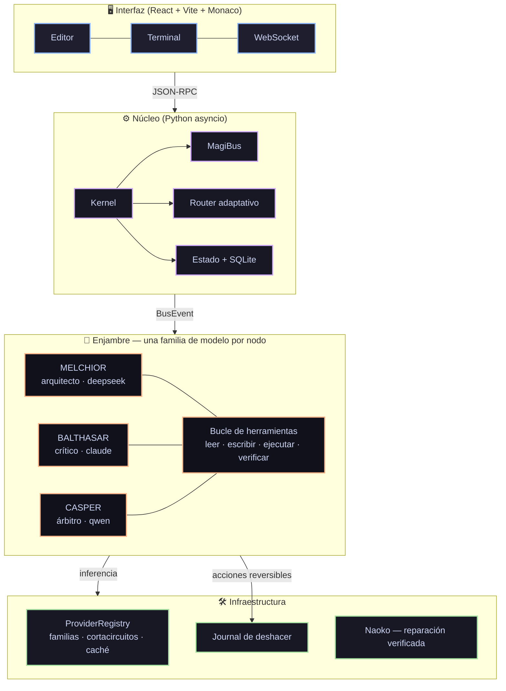

# MAGI System IDE 🖥️🤖

Entorno de desarrollo con un **enjambre de tres inteligencias que debaten** antes
de actuar, y **herramientas reales sobre tu máquina** para ejecutar lo que deciden.

Inferencia **100 % de nube gratuita**: sin claves de API, sin modelos locales,
sin suscripciones.

---

## Cómo funciona



### El enjambre

| Nodo | Rol popperiano | Familia | Puede |
|---|---|---|---|
| **MELCHIOR • 1** | Creador / sintetizador | `deepseek` | leer, escribir, ejecutar |
| **BALTHASAR • 2** | Crítico hostil / falsacionista | `claude` | leer y **ejecutar**, no escribir |
| **CASPER • 3** | Juez / árbitro de concordia | `qwen` | leer y verificar tests |

Que Balthasar no pueda escribir no es una restricción de seguridad: es lo que le
da autoridad. Una crítica que dice *«esto falla con entrada vacía»* **habiendo
ejecutado el caso** vale mucho más que una que lo sospecha.

### Enrutamiento adaptativo

No todo merece un debate de tres rondas.

| Ruta | Cuándo | Coste |
|---|---|---|
| `chat` | saludo, confirmación | 1 llamada |
| `lookup` | pregunta factual | 1 llamada + web |
| `task` | acción concreta sobre ficheros o código | Melchior + verificación |
| `build` | proyecto, juego, emulador, investigación | debate completo iterado |

---

## Instalación

Descarga la última versión de **[Releases](https://github.com/4n0th1ng/MAGI-System-IDE/releases)**,
extrae y ejecuta el `.exe`. No hay que configurar claves ni descargar modelos.

Desde el código:

```bash
pip install -r requirements.txt
cd magi-gui && npm install && npm run build && cd ..
python -m magi.main
```

---

## Tecnologías

**Núcleo:** Python 3.10+ · asyncio · pydantic · SQLite · WebSockets · PyWebView
**Interfaz:** React 19 · TypeScript · Vite · Monaco Editor · xterm.js · Zustand
**Inferencia:** g4f — nube gratuita sin claves, con proveedor fijado por familia

---

## Estado del proyecto — MAGI 9.0

Esta versión es una **reconstrucción del núcleo**. El diagnóstico que la motivó,
con la evidencia de cada punto, está en [`PLAN-MAGI-9.md`](PLAN-MAGI-9.md).

Lo que se arregló, y qué había antes:

| Área | v5.0.28 | Ahora |
|---|---|---|
| **Diversidad del enjambre** | `cloud.py:122` reescribía `deepseek`, `claude-3.5-sonnet` y `qwen-2.5` a `gpt-4o`: los tres nodos eran **el mismo modelo** | Proveedor g4f fijado por familia; **10 familias** disponibles, 3 repartidas |
| **Herramientas** | Los agentes solo emitían texto; la única acción era un regex que ejecutaba bloques ` ``` ` a ciegas | Bucle de herramientas: leer, escribir, ejecutar, verificar |
| **Reversibilidad** | Ninguna | Journal de escrituras + `undo` por operación o por tarea |
| **Timeouts** | Ninguno: un proveedor colgado congelaba el sistema | Timeout duro por llamada, con failover |
| **Cortacircuitos** | `_is_alive` y `_mark_failure` definidos, **cero sitios de llamada** | Implementado y llamado, con p50/p95 por proveedor |
| **Caché** | `dict` sin límite → fuga de memoria | LRU + TTL acotada |
| **Rutas** | `D:/PROYECTOS/MAGI System IDE` en 8 sitios: el `.exe` solo arrancaba en una máquina | `magi.core.paths`, verificado en CI |
| **Base de datos** | `magi_brain.db` commiteado con datos reales | En el directorio de datos del usuario |
| **Estilo narrativo** | `<select>` que no enviaba su valor a ninguna parte | Llega al prompt de los tres agentes y persiste |
| **Selector de motor** | `kernel.py:216` no pasaba `engine` a `submit_task` | Propagado |
| **Aprobación por diff** | Los `sendCommand` estaban comentados: pulsar «Aprobar» no llegaba al backend | Reconectado |
| **Versionado de Naoko** | Default `v1.0.0` produjo el commit `1eb7e87`, una **regresión** entre v5.0.24 y v5.0.25 | Versión leída de git; si no se puede determinar, **no se etiqueta** |
| **Publicación de Naoko** | `git add .` + commit + tag + push, sin revisar ni verificar | Solo los ficheros del parche, y sin push automático |
| **Contexto** | Los agentes no sabían la fecha ni en qué SO corrían | Bloque de contexto real en cada prompt |
| **Tests** | En `scratch/` (gitignorado); `test_area0` en rojo | **77 tests** versionados, CI en Linux y Windows |
| **Módulos aleatorios** | `quantum_oracle` devolvía `random.choice`; `quant/simulator` devolvía `np.random` como índice de riesgo | Retirados a [`magi/_attic/`](magi/_attic/) con nota de por qué |

### Regla de trabajo

> **Cada cambio conecta o borra. Nunca añade sin conectar.**

Si un módulo no tiene sitio de llamada y un test, no entra. En v5.0.28 doce
subsistemas se instanciaban en `main.py` y diez tenían **cero** llamadas: existían
para imprimir su propio nombre en el arranque.

---

## Desarrollo

```bash
python -m pytest tests/ -v        # 77 tests, sin red
ruff check magi/ tests/           # lint
```

---

## Hoja de ruta

Completado: fundamentos (§1), bucle de herramientas (§2.2), enrutamiento (§2.3),
reversibilidad (§4.2), contexto de ejecución (§4.3), versionado de Naoko (§3.3).

Siguiente: streaming en la interfaz (§1.2), estado persistente entre reinicios
(§1.4), ciclo completo de reparación verificada de Naoko (§3.1), toolchain de
ingeniería inversa para emuladores (§5.3), y fábrica de artefactos (§5).

---

*MAGI System IDE — enjambre de inteligencias con manos.*
