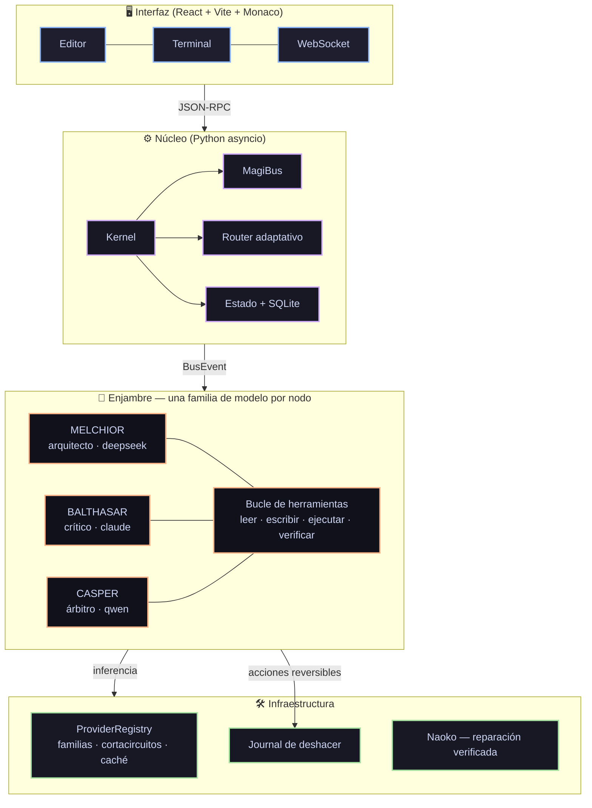

# MAGI System IDE 🖥️🤖

Entorno de desarrollo con un **enjambre de tres inteligencias que debaten** antes
de actuar, y **herramientas reales sobre tu máquina** para ejecutar lo que deciden.

Inferencia **100 % de nube gratuita**: sin claves de API, sin modelos locales,
sin suscripciones.

---

## Cómo funciona



### El enjambre

| Nodo | Rol popperiano | Familia | Puede |
|---|---|---|---|
| **MELCHIOR • 1** | Creador / sintetizador | `deepseek` | leer, escribir, ejecutar |
| **BALTHASAR • 2** | Crítico hostil / falsacionista | `claude` | leer y **ejecutar**, no escribir |
| **CASPER • 3** | Juez / árbitro de concordia | `qwen` | leer y verificar tests |

Que Balthasar no pueda escribir no es una restricción de seguridad: es lo que le
da autoridad. Una crítica que dice *«esto falla con entrada vacía»* **habiendo
ejecutado el caso** vale mucho más que una que lo sospecha.

### Ingeniería inversa y emuladores

Diez herramientas que el enjambre puede invocar directamente:

| Herramienta | Qué hace |
|---|---|
| `binary_identify` | formato, ISA, endianness, punto de entrada, consola probable |
| `console_profile` | CPU, RAM, GPU, base de carga y formatos de PSP, NDS, Vita, GBA, PSX, N64, 3DS |
| `disassemble` | Capstone: MIPS y ARM, con modo Thumb y endianness explícitos |
| `binary_strings` | cadenas ASCII con desplazamiento |
| `emulate_code` | ejecuta un fragmento con Unicorn y devuelve los registros |
| `differential_test` | compara tu emulador contra Unicorn y localiza la instrucción que diverge |
| `compare_consoles` | tabla de contraste entre consolas |
| `analyze_port` | qué cuesta portar un emulador de una consola a otra, subsistema a subsistema |
| `suggest_port_base` | qué emulador conviene como base, ordenado por reutilización real |
| `index_emulator` | indexa el código de un emulador y clasifica cada fichero en subsistemas |
| `locate_subsystem` | dónde vive el dynarec, la GPU o el HLE, con ficheros y líneas reales |
| `compare_emulators` | contrasta dos emuladores por subsistema, con líneas de código |
| `re_toolchain_status` | qué está instalado |

Funciona con `capstone` y `unicorn` (paquetes pip). Ghidra y radare2 se detectan
si están y añaden decompilación a C y xrefs globales, pero **no son necesarios**.

Ejemplo de lo que responde `analyze_port psp vita`:

```
gpu              irreducible    pipeline fijo -> programable: el backend
                                gráfico se reescribe entero, no se adapta
dynarec          reemplazar     frontend de mips y emisión para arm; la IR
                                intermedia sí se reutiliza
frontend         reutilizable   interfaz, configuración, entrada y grabación
--------------------------------------------------------------------------
reutilización estimada: 55%
```

Y `suggest_port_base vita` responde **Nintendo 3DS** (71%) antes que PSP (55%),
porque ARMv6K→ARMv7-A con shaders en ambas reutiliza más que MIPS→ARM con
pipeline fijo — aunque PPSSPP sea el emulador más conocido.

`analyze_port` compara **consolas** desde sus perfiles de hardware. Para trabajar
sobre código real, `index_emulator` recorre el árbol de fuentes y clasifica cada
fichero en subsistemas; `compare_emulators` los contrasta con líneas reales:

```
subsistema            PPSSPP     melonDS   razón
dynarec                  504       1,502   0.3x
hle_sistema              401           0   solo A

Lectura:
- dynarec: melonDS dedica 3.0x más código. Si vas a portar en esa
  dirección, ahí se concentra el trabajo que no se ve en la tabla de consolas.
- hle_sistema: solo existe en PPSSPP; melonDS tendría que escribirlo entero.
```

### Fábrica de artefactos con bucle de observación

El sistema **mira lo que produce** antes de dártelo:

| Artefacto | Qué observa |
|---|---|
| Programa | lo arranca y captura la salida y el código de retorno |
| Juego | lo ejecuta headless, avanza fotogramas y **captura la pantalla** |
| Imagen | tamaño, número de colores, color dominante |
| Documento | páginas, párrafos, palabras; detecta plantillas vacías |

El caso que justifica el bucle entero: un juego donde el jugador es del mismo
color que el fondo. El código es correcto, los tests pasarían, y en pantalla no
se ve nada. Leyendo el código no se detecta:

```
[FALLA] juego: 30 fotogramas dibujados
  · 320x240, 1 colores; el dominante (20, 20, 30) ocupa el 100%
  problemas observados:
  · la pantalla es de un solo color: el juego dibuja pero no se ve nada
```

Y no gasta cuota de visión: es análisis de histograma con Pillow.

### Manga

La composición —rejilla, orden de lectura **derecha a izquierda**, globos,
validación de solapes— es geometría determinista y está construida y probada.
La generación de los dibujos necesita ComfyUI local (gratis, sin claves) y va
detrás de un backend enchufable: sin ComfyUI las viñetas salen como marcadores
de posición y el sistema **lo dice**, en vez de fingir que dibujó.

`validate_manga_layout` comprueba solapes, huecos y viñetas fuera de página
**antes** de generar nada — generar ocho viñetas y descubrir después que dos se
pisan es tirar ocho generaciones.

### Catálogo acotado por dominio

El catálogo de herramientas entra entero en cada prompt. Con 30 herramientas
son 3069 caracteres, que en un proveedor gratuito es mucho. Cada tarea recibe
solo su dominio:

| Tarea | Herramientas | Catálogo |
|---|---|---|
| «arregla el bug del scroll» | 12 | 890 chars |
| «crea un juego de plataformas» | 17 | 1676 chars |
| «analiza el dynarec de PPSSPP» | 25 | 2563 chars |

Ante la duda, catálogo completo: mejor grande que insuficiente.

### Enrutamiento adaptativo

No todo merece un debate de tres rondas.

| Ruta | Cuándo | Coste |
|---|---|---|
| `chat` | saludo, confirmación | 1 llamada |
| `lookup` | pregunta factual | 1 llamada + web |
| `task` | acción concreta sobre ficheros o código | Melchior + verificación |
| `build` | proyecto, juego, emulador, investigación | debate completo iterado |

---

## Instalación

Descarga la última versión de **[Releases](https://github.com/4n0th1ng/MAGI-System-IDE/releases)**,
extrae y ejecuta el `.exe`. No hay que configurar claves ni descargar modelos.

Desde el código:

```bash
pip install -r requirements.txt
cd magi-gui && npm install && npm run build && cd ..
python -m magi.main
```

---

## Tecnologías

**Núcleo:** Python 3.10+ · asyncio · pydantic · SQLite · WebSockets · PyWebView
**Interfaz:** React 19 · TypeScript · Vite · Monaco Editor · xterm.js · Zustand
**Inferencia:** g4f — nube gratuita sin claves, con proveedor fijado por familia

---

## Estado del proyecto — MAGI 9.0

Esta versión es una **reconstrucción del núcleo**. El diagnóstico que la motivó,
con la evidencia de cada punto, está en [`PLAN-MAGI-9.md`](PLAN-MAGI-9.md).

Lo que se arregló, y qué había antes:

| Área | v5.0.28 | Ahora |
|---|---|---|
| **Diversidad del enjambre** | `cloud.py:122` reescribía los alias a `gpt-4o` **y** `agents.py` pedía `model="gpt-4o-mini"` en los tres nodos: dos capas colapsando al mismo modelo | Cada nodo declara su familia y la pide explícitamente. Verificado de extremo a extremo, no solo en el registro |
| **Herramientas** | Los agentes solo emitían texto; la única acción era un regex que ejecutaba bloques ` ``` ` a ciegas | Bucle de herramientas en los tres nodos: leer, escribir, ejecutar, verificar. Traza visible en la interfaz |
| **Enrutamiento** | Toda petición pagaba el debate completo: "hola" costaba 9 llamadas y 90 s | 4 rutas con presupuesto de rondas y herramientas propio |
| **Reversibilidad** | Ninguna | Journal de escrituras + `undo` por operación o por tarea |
| **Timeouts** | Ninguno: un proveedor colgado congelaba el sistema | Timeout duro por llamada, con failover |
| **Cortacircuitos** | `_is_alive` y `_mark_failure` definidos, **cero sitios de llamada** | Implementado y llamado, con p50/p95 por proveedor |
| **Caché** | `dict` sin límite → fuga de memoria | LRU + TTL acotada |
| **Rutas** | `D:/PROYECTOS/MAGI System IDE` en 8 sitios: el `.exe` solo arrancaba en una máquina | `magi.core.paths`, verificado en CI |
| **Base de datos** | `magi_brain.db` commiteado con datos reales, y tres rutas distintas según cómo se instanciara | Una sola ruta vía `paths.db_path()`, fuera del repositorio |
| **Estado entre reinicios** | `active_tasks = {}` en RAM: cerrar la ventana perdía la conversación | Persistido en SQLite y rehidratado al arrancar |
| **Streaming** | `create()` sin `stream=True`: 30-90 s de pantalla quieta por turno | Token a token con cursor en vivo; caída a no-streaming si el proveedor no lo soporta |
| **Contabilidad de tokens** | Ninguna | `token_ledger` por tarea, agente y familia |
| **Estilo narrativo** | `<select>` que no enviaba su valor a ninguna parte | Llega al prompt de los tres agentes y persiste |
| **Selector de motor** | `kernel.py:216` no pasaba `engine` a `submit_task` | Propagado |
| **Aprobación por diff** | Los `sendCommand` estaban comentados: pulsar «Aprobar» no llegaba al backend | Reconectado |
| **Versionado de Naoko** | Default `v1.0.0` produjo el commit `1eb7e87`, una **regresión** entre v5.0.24 y v5.0.25 | Versión leída de git; si no se puede determinar, **no se etiqueta** |
| **Publicación de Naoko** | `git add .` + commit + tag + push, sin revisar ni verificar | Solo los ficheros del parche, y sin push automático |
| **Contexto** | Los agentes no sabían la fecha ni en qué SO corrían | Bloque de contexto real en cada prompt |
| **Tests** | En `scratch/` (gitignorado); `test_area0` en rojo | **317 tests** versionados —incluidos los de integración que recorren el camino real—, CI en Linux y Windows |
| **Propuestas** | Una sola, secuencial | 2-3 enfoques en paralelo; el crítico los compara |
| **Crítica** | Un párrafo genérico | 4 ejes concurrentes: corrección, seguridad, plataforma, rendimiento |
| **Código propuesto** | Llegaba al árbitro sin ejecutarse: tres rondas debatiendo sobre código que no compila | Verificado antes de la crítica; si falla vuelve al autor sin gastar ronda |
| **Memoria del debate** | Cuatro subsistemas de memoria instanciados y nunca llamados | Memoria episódica que inyecta lo ya refutado en la ronda siguiente |
| **Observabilidad** | Naoko solo se enteraba de excepciones: un proveedor a 25 s o una herramienta fallando el 40 % eran invisibles | Latencias p50/p95/p99, tasas de fallo y alertas con acción automática |
| **Deriva de proveedor** | Especificada en §I.8 desde la primera versión del plan, nunca implementada | Sonda canaria periódica: 3 preguntas con respuesta conocida a temperatura 0 |
| **Auto-mejora** | `EvolverAgent` con "Motor de Evolución Genética" en el log de arranque, instanciado y nunca llamado | Banco de 10 tareas verificables por código; un cambio solo se conserva si mejora sin regresiones |
| **Módulos aleatorios** | `quantum_oracle` devolvía `random.choice`; `quant/simulator` devolvía `np.random` como índice de riesgo | Retirados a [`magi/_attic/`](magi/_attic/) con nota de por qué |

### Reglas de trabajo

> **1. Cada cambio conecta o borra. Nunca añade sin conectar.**

> **2. Un test sobre una pieza aislada no demuestra que el sistema la use.**

> **3. Toda pieza necesita una prueba de CABLEADO, no solo de comportamiento.**

> **4. Arrancar el sistema encuentra bugs que leerlo no encuentra.**

La segunda regla salió de un error real cometido durante esta misma
reconstrucción: la diversidad se arregló en `ProviderRegistry`, los tests
unitarios de `select_for_swarm()` pasaban en verde... y el enjambre seguía
colapsando a una sola familia, porque nunca llamaba a esa función. Iba por
`agents.py`, que pedía `model="gpt-4o-mini"` en los tres nodos.

Volvió a pasar dos veces más: `VerifiedRepair` escrito y sin conectar mientras
Naoko seguía ejecutando scripts a ciegas, y el bucle de herramientas conectado
solo a Naoko mientras los tres nodos del enjambre seguían sin poder abrir un
fichero. En los tres casos los tests unitarios estaban en verde.

Por eso hay tres capas de defensa: `tests/test_swarm_integration.py` recorre
orquestador → agentes → proveedor y comprueba el resultado observable,
`tests/test_wiring.py` audita el **grafo de llamadas con AST** —no mira si una
función funciona, mira si el sistema la invoca—, y `tests/test_bugfixes_2.py`
construye el kernel de verdad y compara el **contrato de eventos entre backend y
frontend**, porque una alerta que solo llega al log del servidor es una función
invisible.

Si un módulo no tiene sitio de llamada y un test, no entra. En v5.0.28 doce
subsistemas se instanciaban en `main.py` y diez tenían **cero** llamadas: existían
para imprimir su propio nombre en el arranque.

---

## Desarrollo

```bash
python -m pytest tests/ -v        # 317 tests, sin red
ruff check magi/ tests/           # lint
```

---

## Hoja de ruta

**Fase 1 completa** — capa de proveedores (§1.1), streaming extremo a extremo
(§1.2), anclaje de rutas (§1.3), estado persistente (§1.4), tests y CI (§1.5),
higiene del repositorio (§1.6).

**Fase 2 completa** — bucle de herramientas (§2.2), enrutamiento adaptativo
(§2.3), paralelismo de propuestas y crítica multi-eje (§2.4), verificación
ejecutable antes del arbitraje (§2.5), memoria episódica (§2.6), estilo
narrativo conectado (§2.7).

**Fase 3 completa** — reparación verificada (§3.1), ediciones quirúrgicas
(§3.2), versionado seguro (§3.3), observabilidad proactiva (§3.4) y auto-mejora
medible (§3.5).

**Fase 4 completa** — toolchain de ingeniería inversa y emuladores (§5.3),
fábrica de artefactos con bucle de observación (§5.1, §5.2, §5.6), composición
de manga (§5.4) y vídeo programático con FFmpeg (§5.5).

**Fase 5 en curso** — conocimiento del mundo (§6): macro y geopolítica desde
FRED, BCE y Banco Mundial (§6.1, §6.2); fundamentales desde SEC EDGAR XBRL,
aritmética financiera determinista y registro de tesis con calibración medible
(§6.3). Todas las fuentes son gratuitas y **sin clave de API**, según tu
restricción.

**Fase 5 en curso** — además del conocimiento del mundo (§6): aprobación con
contexto (§7.4), visor de diffs real (§7.3) y el arranque de la descomposición
de `App.tsx` (§7.1). La interfaz tiene tests por primera vez y entran en CI.

**Siguiente** — el layout multi-panel completo (§7.2), paleta de comandos, y
la recogida de resultados de ComfyUI, que exige un ComfyUI real contra el que
probarla.

### Sobre capacidades que existen y no se pueden usar

Pediste que la interfaz «tenga todas las implementaciones necesarias para
aplicar todas las funcionalidades». Auditar literalmente eso —qué handlers RPC
del kernel tienen quien los llame desde la interfaz— encontró **tres
capacidades completas, probadas y enganchadas al bus, sin forma de
invocarlas**:

| Capacidad | Sección | Estado |
|---|---|---|
| `obs.metrics` — panel de salud | §3.4 | construida, inalcanzable |
| `eval.run` — banco de evaluación | §3.5 | construida, inalcanzable |
| `naoko.self_improve` — auto-mejora medible | §3.5 | construida, inalcanzable |

La última es exactamente lo que se pidió al encargar todo esto —«que haga
perfectible al sistema»— así que era el peor sitio posible para dejar un cable
suelto. El motor estaba hecho; faltaba el botón. Ahora hay una pestaña
**Sistema** con las tres, y un test que impide que vuelva a pasar: todo handler
nuevo o tiene quien lo invoque, o se declara exento con su motivo.

### Sobre medir antes de optimizar

El plan apuntaba a la «virtualización de lista» porque «los historiales largos
hunden el render». Al medirlo, el reparto real del coste era otro:

```
4000 anexiones al terminal        →  4,9 MB de cadena en memoria
200 repintados × 2 `.includes()`  →  532 ms  (2,7 ms POR REPINTADO)
50 repintados × 800 mensajes      →    3 ms  (el `.map` es gratis)
```

El `.map` no era el problema. Lo era que `terminalOutput` se concatenaba sin
límite y que `App.tsx` lo recorría entero **dos veces por repintado** buscando
la frase «Esperando aprobación interactiva del usuario», con un `useEffect` que
se dispara en cada línea nueva. Cada línea de salida de una herramienta costaba
2,7 ms de puro escaneo de cadena antes de tocar el DOM, y la salida de un solo
`grep` son cientos de líneas seguidas.

Así que se acotó la cadena, se sustituyeron los escaneos por una bandera que se
pone al llegar el evento, y se limitó cuántos mensajes se montan — porque lo
caro de la lista es un `ReactMarkdown` por mensaje, no recorrerla. Virtualizar
sin lo primero habría sido optimizar lo que no dolía.

### Sobre el botón de parada

El acceso sin restricciones a tu máquina es una decisión tuya y se sostiene
sobre dos salidas: poder **deshacer** lo hecho y poder **parar** lo que se está
haciendo. El journal (§4.2) cubría la primera. La segunda no existía.

`Kernel._handle_estop` era, entero:

```python
logger.critical("E-STOP INVOCADO DESDE LA GUI")
return "EMERGENCY_STOP_TRIGGERED"
```

Una línea de log y una cadena con aspecto de éxito. No cancelaba ningún bucle
ni mataba ningún proceso. Y el del enjambre publicaba *"aplicando kill-switch
local automatizado"* sin aplicar ninguno.

Ahora hay un supervisor que lleva la cuenta de lo que está en marcha —bucles y
subprocesos, por tarea—, manda primero `SIGTERM` para que los procesos cierren
limpio y solo `SIGKILL` si no atienden, y devuelve un informe de lo que paró
**de verdad**, incluidos los procesos que no murieron. Hay además `PARAR ESTA`
además de `PARAR TODO`: si tienes tres conversaciones y una se va por las
ramas, no hay por qué tirar las otras dos.

### Sobre lo que se cuenta y no se guarda

El panel de coste (§7.3) no faltaba por falta de sitio en la interfaz: faltaban
los datos. La contabilidad de tokens estaba construida entera menos el cable
del medio — `agent_loop.py` sumaba los tokens de cada respuesta, `AgentTurn`
los traía hasta el enjambre, y `TaskStore.record_usage()` sabía escribirlos en
la tabla `token_ledger`. No la llamaba nadie. Los números llegaban a
`agents.py`, se metían en una cadena de log con `turn.summary()` y se tiraban.

Es la misma familia que una pieza escrita y no conectada, pero en los datos, y
cuesta más verla porque no falta ningún import: el esquema está, los métodos
están, y la tabla simplemente nunca recibe una fila.

Lo que hace útil el panel no es la tabla de tokens sino los avisos de arriba.
El más importante detecta que los tres nodos corrieron sobre la **misma
familia de modelo** — el fallo original de v5.0.28, que convierte el debate
popperiano en un modelo hablando solo.

### Sobre aprobar a ciegas

El panel de aprobación se titulaba "Aprobación de Código Requerida" y no
enseñaba el cambio. Recibía `originalCode=""`, así que la columna del código
original salía siempre vacía y todo lo demás aparecía en verde como si fuera
nuevo. El estado de aprobación ni siquiera venía de un evento: se deducía
buscando la frase "Esperando aprobación interactiva del usuario" dentro del
texto del terminal, y el "cambio propuesto" era el último mensaje de un agente.

De las dos formas de aprobar a ciegas, esa es la mala: la que parece una
revisión. Ahora el backend publica `swarm.approval_required` con los ficheros
afectados, su contenido antes y después, las órdenes que se van a ejecutar y
si los tests pasaron; y el visor los alinea con un diff por subsecuencia común
más larga, que sí muestra los borrados.

El "antes" no hizo falta inventarlo: el journal de escrituras del §4.2 ya
guardaba el estado previo de cada fichero para poder deshacer. La misma copia
que da la reversibilidad responde a la pregunta de qué había antes.

### Sobre el vídeo, y sobre mirar lo que uno hace

De la tabla de §5.5 solo están construidos los dos primeros escalones —vídeo
programático y animática desde stills— porque son los que dan resultado
profesional hoy y sin coste. El gen-vídeo largo y coherente no está resuelto
localmente en hardware de escritorio, y fingirlo sería el mismo error que el
`np.random.randint` con vocabulario financiero.

Lo que sí importa aquí es que el vídeo pasa por el mismo bucle de observación
que el resto: el sistema **mira** lo que produjo. Un vídeo tiene dos formas de
salir mal que son invisibles a cualquier comprobación barata, porque el fichero
existe, pesa megas y se reproduce: que esté todo en negro, y que esté congelado
—todos los fotogramas idénticos, la animación que no animó—. `observe_video`
muestrea fotogramas separados en el tiempo y los compara. Sin eso, "vídeo
generado, 12 MB, 30 s" es un informe que suena a éxito.

### Sobre "las habilidades de Warren Buffett"

Es la parte del encargo donde más fácil sería venderte humo, así que conviene
que quede escrito. El juicio de Buffett —sesenta años de criterio, una red de
contactos, capital permanente y temperamento bajo pánico— no es software, y
cualquier producto que diga tenerlo te está vendiendo un generador de números
con vocabulario financiero. El `quant/simulator.py` de v5.0.28 devolvía
literalmente `np.random.randint(60, 101)` como "índice risk-off"; está retirado.

Lo que sí es construible es la contabilidad que él hace a mano y casi nadie
hace, y eso está: ganancias del propietario con el capex de mantenimiento
separado, ROIC, dilución real medida sobre el recuento de acciones, conversión
de caja, y un descuento de flujos que **nunca devuelve un número solo** sino la
rejilla de sensibilidad y qué porcentaje del valor es terminal. Toda la
aritmética se ejecuta en Python y enseña su fórmula y sus entradas: el modelo
interpreta y argumenta, no calcula.

Y lo que de verdad se le parece: el registro de tesis. Cada afirmación se
congela con su fecha, su razonamiento, sus fuentes y su confianza declarada, y
se puntúa al vencer con la regla de Brier contra la línea base. Acertar mucho
es fácil si solo predices lo obvio; lo que mide el criterio es la calibración
—que cuando dices 70 % aciertes el 70 %— y el sistema informa de su propio
exceso de confianza. Es la única forma de que puedas fiarte de él, que es la
condición para dejarlo trabajar solo.

### Sobre la auto-mejora

Pediste que el sistema se hiciera perfectible a sí mismo. La forma honesta de
conseguirlo no es un motor de evolución genética: es un banco con solución
**comprobable por código**, medir antes y después, y conservar el cambio solo si
mejora sin romper nada. Un sistema que solo se modifica deriva; uno que mide si
mejoró, mejora. La regla de decisión es deliberadamente conservadora — cualquier
regresión rechaza el cambio, porque romper algo que funcionaba pesa más que
arreglar algo que no.

---

*MAGI System IDE — enjambre de inteligencias con manos.*
